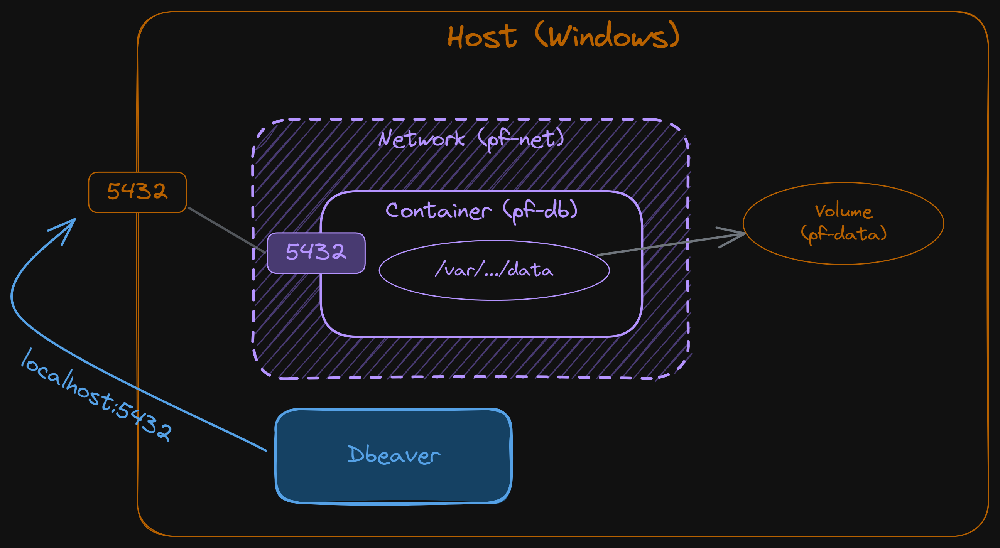
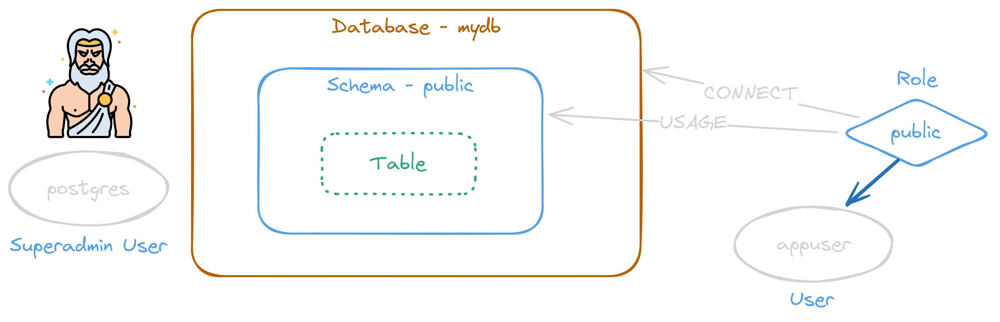
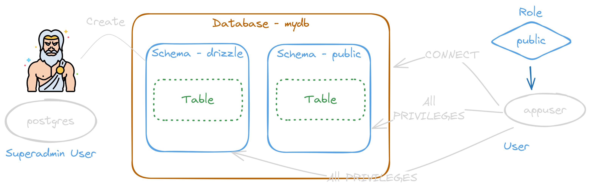

<style>
@import url('https://fonts.googleapis.com/css2?family=Prompt:ital,wght@0,100;0,300;0,400;0,700;1,100;1,300;1,400;1,700&display=swap');

    :root {
    font-family: Prompt;
    --hl-color: #D57E7E;
}
h1 {
  font-family: Prompt
}
</style>

# Fullstack Development

---

# Preflight project - database

[Github Repo](https://github.com/fullstack-67/pf-db)

---

# Prerequisite

- Docker
  - Docker desktop
- Database management tools
  - Dbeaver

---

# Database choices

- Relatonal database [(Comparison)](https://strapi.io/blog/relational-databases-postgresql-vs-mariadb-vs-mysql-vs-sqlite)
  - PostgreSQL
  - MariaDB / MySQL
  - SQLite
- NoSQL
  - [Types](https://www.geeksforgeeks.org/types-of-nosql-databases/)
  - [Vendors](https://www.geeksforgeeks.org/open-source-nosql-databases/)

---

# Docker 101

---

# Containers

- Containers provide a way of creating an isolated environment in which applications and their dependencies can live.
- Why?
  - Portability (save container to registry or even USB)
  - Consistency (works everywhere)
  - Easy deployment (can test on local machine)

---

# Docker

- A containerization platform
  - Leading player
- Alternative `Podman`

---


---

# Should you run database on docker container?

> [It depends.](https://devops.stackexchange.com/a/3374)

---

# Spinning up database instance

- Files

  - 💾 `./.env` Copy from [here](https://github.com/fullstack-67/pf-db/blob/main/.env.example).

  - 💾 `./.gitignore` [(link)](https://github.com/fullstack-67/pf-db/blob/main/.gitignore)

  - 💾 `./docker-compose.yml` [(link)](https://github.com/fullstack-67/pf-db/blob/main/docker-compose.yml)

- ⌨️ `docker compose up -d`

---



---

# Database user management

---



---


---



---

# DB user management

- `docker exec -it pf-db bash`
- `psql -U postgres -d mydb`
  - Note that you do not need to input password here due to how the image is [setup](https://hub.docker.com/_/postgres). (See section in `POSTGRES_PASSWORD`)

---

- Don't forget to change the password for `appuser`.

```sql
REVOKE CONNECT ON DATABASE mydb FROM public;
REVOKE ALL ON SCHEMA public FROM PUBLIC;
CREATE USER appuser WITH PASSWORD '1234';
CREATE SCHEMA drizzle;
GRANT ALL ON DATABASE mydb TO appuser;
GRANT ALL ON SCHEMA public TO appuser;
GRANT ALL ON SCHEMA drizzle TO appuser;
```

---

# Note on `psql`

- `\l` to list all databases
- `\du` to list users
- `\dn` to list schema
- `\dt` to list tables
- `\c` to view connected database or change to another db.
- `\q` to quit

---

# ORM

- `Object Relational Mapper`
- A piece of software designed to translate between the data representations used by databases and those used in programming (in our case, Typescript).

---

# Why ORM?

- Get type information when interacting with database.
- Write schema file
  - Good for documentation
- Nice Tooling
  - Database synchronization
  - Schema generation from existing database
  - Database viewer
  - Migration tool

---

# Should you use ORM?

> [It depends.](https://stackoverflow.com/a/1279678)

---

# JavaScript / TypeScript ORM

- [List](https://www.reddit.com/r/node/comments/176zyyh/pick_an_orm_for_2024_and_explain_the_good_the_bad/?utm_source=share&utm_medium=web3x&utm_name=web3xcss&utm_term=1&utm_content=share_button)

---

# Setting up Drizzle

- `npm init -y`
- `npm i drizzle-orm postgres dotenv`
- `npm i -D drizzle-kit`
- `npm i typescript ts-node tsconfig-paths`

---

# Typescript

- `npx tsc --init`
- Add this in `./tsconfig.json`

```json
{
  "ts-node": {
    "require": ["tsconfig-paths/register"]
  },
  "compilerOptions": {
    // ...
    "baseUrl": "./",
    "paths": {
      "@db/*": ["./db/*"]
    }
    // ...
  }
}
```

---

# Database initialization

- Files
  - 💾 `./db/utils.ts` [(Link)](https://github.com/fullstack-67/pf-db/blob/main/db/utils.ts)
  - 💾 `./db/schema.ts` [(Link)](https://github.com/fullstack-67/pf-db/blob/main/db/schema.ts)
  - 💾 `./drizzle.config.ts` [(Link)](https://github.com/fullstack-67/pf-db/blob/main/drizzle.config.ts)
- ⌨️ `npx drizzle-kit push`

---

# Migration

- 💾 `./db/migrate.ts` [(Link)](https://github.com/fullstack-67/pf-db/blob/main/db/migrate.ts)
- ⌨️ `npx drizzle-kit generate`
- ⌨️ `npx ts-node ./db/migrate.ts`

---

# CRUD

- 💾 `./db/client.ts` [(Link)](https://github.com/fullstack-67/pf-db/blob/main/db/client.ts)
- 💾 `./db/prototype.ts` [(Link)](https://github.com/fullstack-67/pf-db/blob/main/db/prototype.ts)
- `npx ts-node ./db/prototype.ts`

---

# Script

To save yourself some typing, add this in `package.json`

```json
{
  // ...
  "scripts": {
    "db:generate": "drizzle-kit generate",
    "db:push": "drizzle-kit push",
    "db:migrate": "ts-node ./db/migrate.ts",
    "db:prototype": "ts-node ./db/prototype.ts"
  }
}
```
