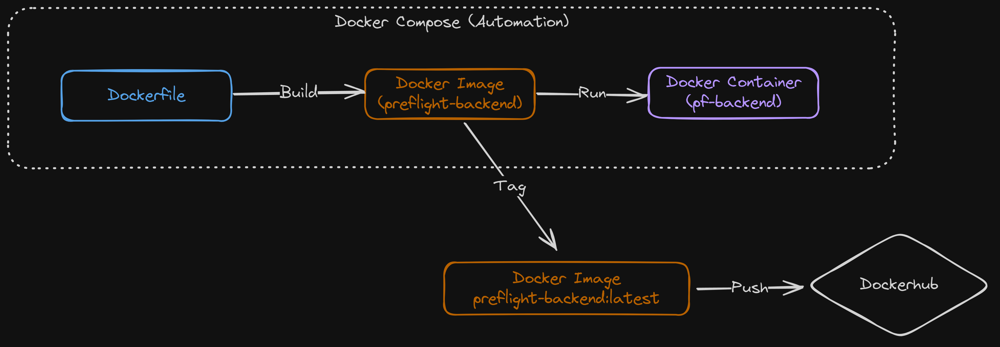
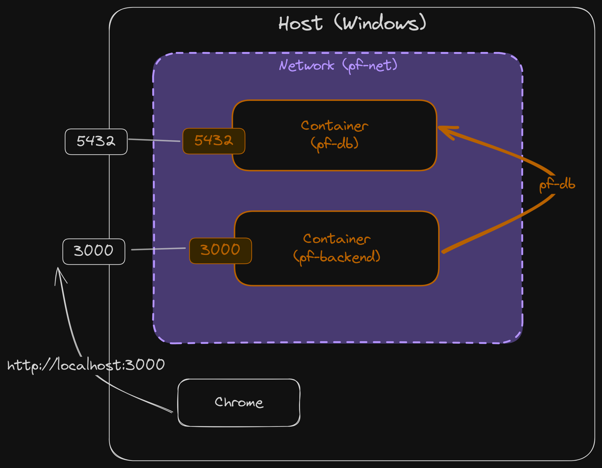

<style>
@import url('https://fonts.googleapis.com/css2?family=Prompt:ital,wght@0,100;0,300;0,400;0,700;1,100;1,300;1,400;1,700&display=swap');

    :root {
    font-family: Prompt;
    --hl-color: #D57E7E;
}
h1 {
  font-family: Prompt
}
</style>

# Fullstack Development

---

# Preflight project - backend

[Github Repo](https://github.com/fullstack-67/pf-backend)

---

# Backend applications

- Data storage
- Business logic
- Authentication / authorization
- APIs for frontend frameworks (_depending on architecture_)
- Connection to other services

---

# Node JS backend frameworks

- [Github stars](https://github.com/vanodevium/node-framework-stars)
- [State of JS 2023](https://2023.stateofjs.com/en-US/other-tools/#backend_frameworks)

---

# Packages

- `npm init -y`
- Express JS
  - `npm i express cors helmet`
- Typescript
  - `npm i typescript ts-node tsconfig-paths`
  - `npm i -D @types/cors @types/express tsc-alias`
- ORM
  - `npm i drizzle-orm postgres dotenv`
  - `npm i -D drizzle-kit nodemon`

---

# Package explanation

| Package   | Details                                     |
| --------- | ------------------------------------------- |
| `express` | Express _(duh!)_                            |
| `helmet`  | Set default HTTP response header            |
| `cors`    | Enable Cross-origin resource sharing (CORS) |
| `nodemon` | Script monitoring during dev                |

---

# ORM code

- All [files](https://github.com/fullstack-67/pf-backend/tree/main/db) in `./db` folder.
  - No need to copy `migration` folder.
  - You can change schema.
- `.\drizzle.config.ts` [(Link)](https://github.com/fullstack-67/pf-backend/blob/main/drizzle.config.ts)

---

# Files

- `./.env` (Copy from [here](https://github.com/fullstack-67/pf-backend/blob/main/.env.example))
- `./nodemon.json` [(Link)](https://github.com/fullstack-67/pf-backend/blob/main/nodemon.json)
- `./.gitignore` [(Link)](https://github.com/fullstack-67/pf-backend/blob/main/.gitignore)
- `./tsconfig.json` [(Link)](https://github.com/fullstack-67/pf-backend/blob/main/tsconfig.json)
- Scripts in `package.json` [(Link)](https://github.com/fullstack-67/pf-backend/blob/b40a890fc14f33d47b3bfc2440e1ef213598a903/package.json#L6-L14)

---

# Note on `tsconfig.json`

- Once we use `outDir` option any non-`./src` folder needs to be included, including the root.

```json
{
  "compilerOptions": {
    "outDir": "./dist",
    }
  },
  "include": ["./*", "./src/**/*", "./db/**/*"]
}
```

---

# Minimal example

- `./src/index.ts` [(Link)](https://github.com/fullstack-67/pf-backend/blob/main/src/index.min.ts)
- Start dev
  - `npm run dev`

---

# Full example

- `./src/index.ts` [(Link)](https://github.com/fullstack-67/pf-backend/blob/main/src/index.ts)
- Build
  - `npm run build`
- Start production
  - `npm run start`

---

# Containerization

---



---

# Steps

- 💾 `./Dockerfile` [(Link)](https://github.com/fullstack-67/pf-backend/blob/main/Dockerfile)
- 💾 `./dockerignore` [(Link)](https://github.com/fullstack-67/pf-backend/blob/main/.dockerignore)
- 💾 `./docker-compose.yml` [(Link)](https://github.com/fullstack-67/pf-backend/blob/main/docker-compose.yml)
- 💾 `./.env.test` from `./.env.test.example` [(Link)](https://github.com/fullstack-67/pf-backend/blob/main/.env.test.example)
- ⌨️ `docker compose --env-file ./.env.test up -d --force-recreate --build`

---



---

# Dockerhub

- Create an account at https://hub.docker.com.
- Create repository called `preflight-backend`.

---

# Push to Dockerhub

- Tag image
  - ⌨️ `docker tag preflight-backend [DOCKERHUB_ACCOUNT]/preflight-backend:latest`
- `docker login`
- Push image
  - ⌨️ `docker push [DOCKERHUB_ACCOUNT]/preflight-backend:latest`

---

# Userful docker commands

- Inspect

  - `docker ps`
  - `docker network ls`
  - `docker volume ls`

- Cleaning
  - `docker image prune -a`
  - `docker builder prune`
  - `docker volume prune`
  - `docker network prune`
