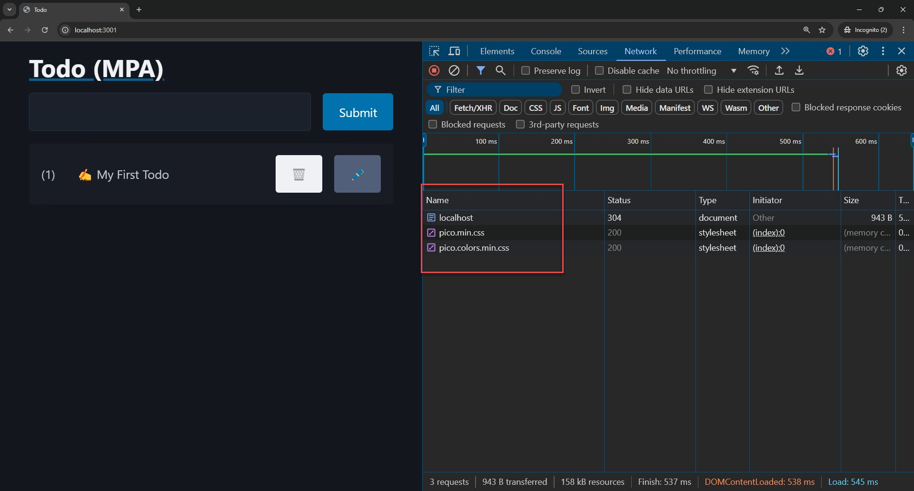
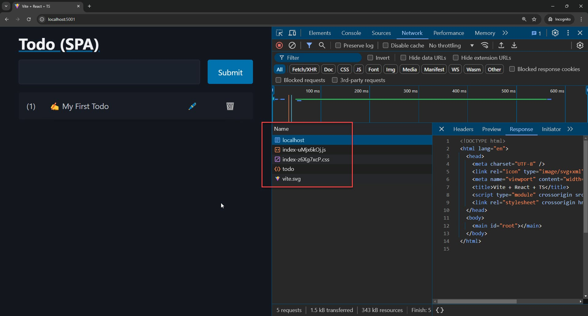
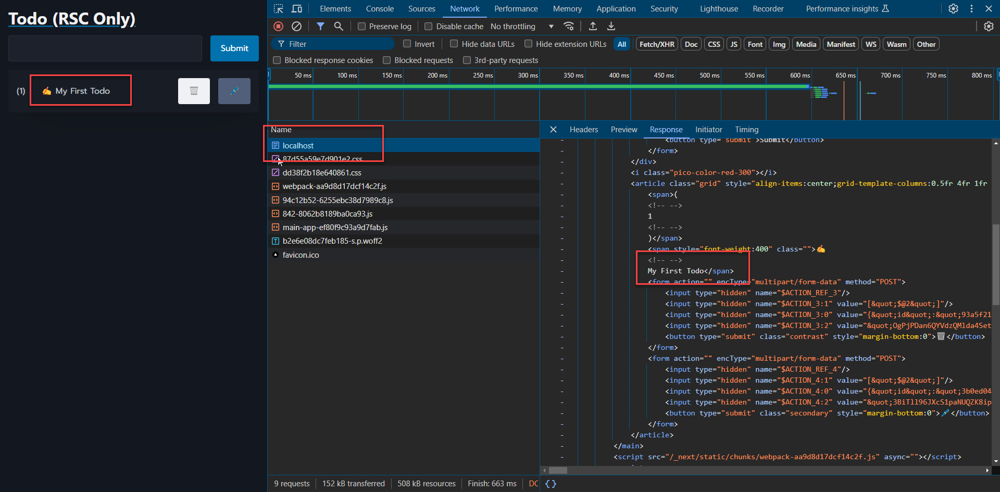

<style>
@import url('https://fonts.googleapis.com/css2?family=Prompt:ital,wght@0,100;0,300;0,400;0,700;1,100;1,300;1,400;1,700&display=swap');

    :root {
    font-family: Prompt;
    --hl-color: #D57E7E;
}
h1 {
  font-family: Prompt
}
</style>

# Fullstack Development

---

# Stack Overflow 2024 Developer Survey [#](https://survey.stackoverflow.co/2024/)

- [Developer types](https://survey.stackoverflow.co/2024/developer-profile#4-developer-type)
- [Databases](https://survey.stackoverflow.co/2024/technology#1-databases)
- [Web framework](https://survey.stackoverflow.co/2024/technology#most-popular-technologies-language-other)
- [Tools](https://survey.stackoverflow.co/2024/technology#1-other-tools)

---

# Fullstack Landscape

> How to over-engineer "todo" apps

---

# 5 Ways to make Todo apps

- Multi-Page Applications (MPA)
- Single-Page Applications (SPA)
- React Server Components (RSC)
- RSC + Client Components (React's New Architecture)
- HTMX

---

# Round 1

> Multi-Page Application (MPA) vs Single-Page Application (SPA)

---

# Multi-page application

- Loads a new page every time you perform an action.
- Traditional web applications.
- Use server-side technologies
  - PHP, Ruby on Rails, ASP.NET, Java, and Node JS.
- Can include JavaScript (`script`) for client-side interactivity

---


---

# Todo app (MPA)

- `Express JS` + `Pug` (renderer)

---

# Get started

- `npm install -g pnpm`
  - I am using `pnpm`.
- `git clone -b mpa https://github.com/fullstack-67/landscape-server mpa`
- `cd mpa`
- `pnpm install`
- `npm run dev`

---

# Endpoint

`./src/index.ts`

```ts
app.get("/", async (req, res) => {
  const message = req.query?.message ?? "";
  const todos = await getTodos();
  // Output HTML
  res.render("pages/index", {
    todos,
    message,
    mode: "ADD",
    curTodo: { id: "", todoText: "" },
  });
});
```

---

# Renderer

`./view/pages/index.pug`

```ts
body
    main(class="container")
        a(href="/")
            h1 Todo (MPA)
        div(id="todoform")
            include ../components/inputform.pug
        div(id="todolist")
            include ../components/todolist.pug
```

---



_Use incognito mode to avoid loading chrome extensions._

---

# Note

- Every button is wrapped in a separate form
  - Need to trigger different endpoints.
- Need to use `input(type="hidden)` to encode additional information.

```js
form(action="/delete" method="POST" style="display: contents")
  input(type="hidden" value=`${todo.id}` name="curId")
  button(type="submit" class="contrast" style="margin-bottom: 0") 🗑️
form(action="/edit" method="POST" style="display: contents")
  input(type="hidden" value=`${todo.id}` name="curId")
  button(type="submit" class="secondary" style="margin-bottom: 0") 🖊️
```

---


---

# Single-page application

- Single-page application
  - Loads a single HTML page and dynamically updates the content as the user interacts with the app.
- Use frontend and backend frameworks separately.

---


---

# Todo app (SPA)

- `Express JS` + `React`

---

# Get started

- `git clone https://github.com/fullstack-67/landscape-spa`
- Backend
  - `cd backend`
  - `pnpm install`
  - `npm run dev`
- Frontend
  - `cd frontend`
  - `pnpm install`
  - `npm run build`
  - `npm run preview`

---



---


---

# Global store

- `zustand`
  

---

# App comparison (UX)

| Item              | MPA | SPA |
| ----------------- | --- | --- |
| No page-refresh   | ❌  | ✅  |
| Spinner           | ❌  | ✅  |
| Element disabling | ❌  | ✅  |

---

# App comparison (technical)

| Item                  | MPA | SPA |
| --------------------- | --- | --- |
| Amount of `JS` loaded | ✅  | ❌  |
| HTML content (SEO)    | ✅  | ❌  |
| State in URL          | ✅  | ❌  |

---

# DX

| Item                 |        MPA |     SPA |
| -------------------- | ---------: | ------: |
| Number of frameworks |       1 ✅ |    2 ❌ |
| Complexity           |    Less ✅ | More ❌ |
| Lines of code        |    Less ✅ | More ❌ |
| Type Safety          |    Less ❌ | More ✅ |
| Hot reloading        | Partial ❌ | Full ✅ |

---

# Amount of Codes

| Dir              | # Files | Total Lines |
| :--------------- | ------: | ----------: |
| _MPA_            |         |             |
| `./src`          |       2 |         161 |
| `./views`        |       3 |          42 |
| _SPA_            |         |             |
| `./backend/src`  |       2 |         144 |
| `./frontend/src` |      10 |      😭 360 |

Total: MPA=203, SPA=504

---

# Round 2

> Back to the server. (Next JS)

---

# Server-Side Rendering (SSR)

- `SSR`
  - Generating the HTML for a web page on the server before sending it to the client’s browser.
- `CSR` (Client-Side Rendering)
  - Browser loads a minimal HTML file and fetches and renders the content using JavaScript.
- See this [explanation](https://www.joshwcomeau.com/react/server-components/?utm_source=pocket_shared#bouncing-back-and-forth-2).

---

# Next JS

- `V12`
  - "Full SSR" (_with DB query_) can only be done through top-level component (_page level_).
  - Use `getServerSideProps` function.
- `V13` (and above)
  - Full SSR can be done through a special components called
    - [_React Server Components_](https://www.joshwcomeau.com/react/server-components/).

---

# Server component

- Run _exclusively_ on the server.
- Generate static HTML.
  - No interactivity (event handlers)
- It's code isn't included in the JS bundle.
  - Never re-render.
  - Output is static without change in router level.
- No hook
  - `useState`, `useEffect` 😍

---

# Server component


[Link](https://www.reddit.com/r/reactjs/comments/150ynj8/arent_react_server_components_just_html_and/?utm_source=share&utm_medium=web3x&utm_name=web3xcss&utm_term=1&utm_content=share_button)

---

# Client component

- The "standard" React components we're familiar with.
- Client Components render on _both_ the client and the server.
  - _Still have SSR._

|                  | Render on server? | Render on client? |
| ---------------- | :---------------: | :---------------: |
| Server Component |        ✅         |                   |
| Client Component |        ✅         |        ✅         |

---

# Why server component?

- First "official" way to run server-exclusive code in React.
- Performance
  - Server Components don't get included in our JS bundles.
  - [Faster load time](https://www.joshwcomeau.com/react/server-components/?utm_source=pocket_shared#advantages-9)
  - [Real use-case](https://bright.codehike.org/)
- Less complications
  - Dependency arrays, stale closures, memoization, ...
  - _(All of these are caused by things changing.)_

---

# Missing piece

### React

> _If RSC output is static, how can I mutate data then?_

---

# Missing piece

### React

> _If RSC output is static, how can I mutate data then?_

### PHP

> _I had solved this problem before you were born, kid._

---


[Link](https://www.w3schools.com/tags/att_form_action.asp)

---

# React's new architecture

- Client component
- Server component
- Server action
  - Asynchronous functions that are executed on the server.
  - Alternative to [API routes](https://nextjs.org/docs/app/building-your-application/routing/route-handlers).

---

# Server Action vs API Route


---

# Form action

- No need to define new endpoints.
- Accept `form-data`
- Colocation
  - Type safe
  - Can "bind" data that is passed thought components' props. 🤯
- Can trigger RSC update without refreshing page. 👍

---

# Todo App (RSC Only)

- `git clone -b rsc-only https://github.com/fullstack-67/landscape-hybrid.git rsc-only`
- `cd rsc-only`
- `pnpm install`
- `npm run build`
- `npm run start`

---

# No blank HTML



---

# No page refresh

> Take that, PHP!


---

# Server components

`./src/app/page.tsx`

```ts
export default async function Home({ params, searchParams }: PageProps) {
  const todos = await getTodos();
  //...
  return <main className="container">...</main>;
}
```

- Async function
- Data fetching without `useEffect`.
  - It only runs once on the _server_. (Try `console.log`)
- Returns HTML to client.

---

# Server Action

`./src/components/FormInput.tsx` _(Slightly modified)_

```tsx
export const FormInput: FC<Props> = async ({ message, mode, curId }) => {
  async function actionCreateTodo(formData: FormData) {
    "use server";
    const todoText = formData.get("todoText") as string; // Receive form-data
    await createTodos(todoText); // DB stuff
    redirect("/?message=&curId=&mode=ADD"); // Update content without refreshing page (Nice!)
  }

  return (
    <form action={actionCreateTodo} style={{ display: "contents" }}>
      <input type="hidden" name="curId" value={curId ?? ""} />
      <button type="submit">{mode === "ADD" ? "Submit" : "Update"}</button>
    </form>
  );
};
```

No need to create endpoint manually.

---

# Automatic binding


---

`./src/components/TodoList.tsx`

```tsx
const ButtonDelete: FC<{ todo: Todo }> = ({ todo }) => {
  async function actionDeleteTodo(formData: FormData) {
    "use server";
    await deleteTodo(todo.id); //👈👈👈👈
    revalidatePath("/");
  }
  return (
    <form action={actionDeleteTodo}>
      <button type="submit">🗑️</button>
    </form>
  );
};
```

- "Binding" `todo` in the server action
- No need to use `form-data`. Type safety!
- No need to include hidden `input` field.

---

# Side note

_(for my future self)_

- `revalidatePath`
  - Used when there is not change in url (params).
- `redirect`
  - Used when you need to change the url (change client states in the url).
- Both `revalidatePath` and `redirect` do not trigger page refresh. (Nice!)

---

# Missing UX/DX

- `UX`
  - Form not resetting after submission.
  - No loading spinner
- `DX`
  - Client state is accessed from url. (`searchParam` in `page.tsx`)
    - Not type safety. Need validation.
  - Still need to include hidden input field (form `input`).
  - _Way too complicated (compared with MPA)_

---

# Hybrid (RSC + RCC)

- `git clone -b rsc-client-v2 https://github.com/fullstack-67/landscape-hybrid.git rsc-client`
- `cd rsc-client`
- `pnpm install`
- `npm run build`
- `npm run start`

---

# Structure


---

# Client component

`./src/components/TodoList.tsx`

```ts
"use client";  //👈 Mark component as client component
//...
export const TodoList: FC<Props> = ({ todos }) => {
  const [curTodo] = useStore((state) => [state.curTodo]);
  return (
    <>
      {...}
    </>
  );
};
```

---

# SSR


---

# SSR

`./src/app/page.tsx`

```ts
export default async function Home() {
  const todos = await getTodos();
  return (
    <main className="container">
      <a href="/">
        <h1>Todo (RSC + RCC)</h1>
      </a>
      <FormInput />
      <TodoList todos={todos} /> //👈 Inject data to client component (SSR)
      <Spinner />
    </main>
  );
}
```

---

# No page refresh


---

# Interactivity


- Elements disabled
- Spinner

---

# Server action in a separate file

`./src/app/actionAdnDb.ts` _(Slightly modified)_

```ts
"use server"; //👈 Mark functions in this file as server actions.
//...
export async function actionCreateTodo(todoText: string) {
  //...
  await createTodos(todoText);
  //...
  revalidatePath("/");
  return { message: "" };
}
```

- You can import this function into client component.
- You don't have to use `form-data` anymore.
- You can `return` data back to client component.

---

# Server action in client component

`./src/components/FormInput.tsx`

```ts
const ButtonSubmit: FC<PropsButtonSubmit> = ({ setMessage }) => {
  // ...
  const submit = actionCreateTodo.bind(null, inputText); //👈 Bind data to server action
  // ...
  function handleClick() {
    setPending(true);
    //👇 Call server action from click event
    submit().then((res) => {
      setMessage(res.message); //👈 Get return data from server action
    }); //...
  }
  // ...
  return <button onClick={handleClick}>Submit</button>;
};
```

- I can trigger server action anywhere, not just `form`.

---

# Type safety

`./src/components/FormInput.tsx`


- You get type safety from client component to database levels 👍.

---

# Flashing UI


---

# Flashing UI

- `revalidatePath` does not block server action from returning.
- I cannot set the `pending` state at the right time.
- [Github Issue](https://github.com/vercel/next.js/discussions/53206)

---

# Line of codes

| Type          | # Line |
| :------------ | -----: |
| MPA           |    203 |
| SPA           |    504 |
| **RSC**       |    292 |
| **RSC + RCC** | 😭 527 |

_(In Next JS project, I counted `src` dir.)_

---

> Have we gone too far?

---

# Round 3

> Back to basic

---

# HTMX

---

# What exactly is HTMX?

> Small JS library that can swap parts of UI with **_HTML response_** from a server.

[2023 JavaScript Rising Stars](https://risingstars.js.org/2023/en#section-framework)

---

# HTMX Demo

- `git clone -b htmx-demo https://github.com/fullstack-67/landscape-server htmx-demo`
- `cd htmx-demo`
- `pnpm install`
- `npm run dev`

---

# Todo app (HTMX)

---

# Get started

- `git clone -b htmx https://github.com/fullstack-67/landscape-server htmx`
- `cd htmx`
- `pnpm install`
- `npm run dev`

---

# Todo app

- The stack is very similar to MPA (`express` + `pug`).
- SSR enabled _(duh!)_
- No reloading
- Spinner enabled
- Form input disabled during submission.

---

# Code count

| Type      | # Line |
| :-------- | -----: |
| MPA       |    203 |
| SPA       |    504 |
| RSC       |    292 |
| RSC + RCC |    527 |
| **HTMX**  | ☺️ 259 |

> _Take that NextJS!_

---

# In addition

- [Hypermedia as the Engine of Application State (HATEOAS)](https://htmx.org/essays/hateoas/)

- [HTMX + Alpine.js](https://dev.to/nicholas_moen/what-i-learned-while-using-django-with-htmx-and-alpine-js-24jg)

---

# Summary

| Architecture | Usage                                                                     |
| ------------ | ------------------------------------------------------------------------- |
| MPA          | Backend-critical (financial, ERP, ทะเบียน)                                |
| SPA          | Dashboards, editor                                                        |
| RSC          | Blogs, brochure sites                                                     |
| RSC + RCC    | Highly interactive website with latest technology (to justify high price) |
| HTMX         | Apps that finish on time                                                  |
