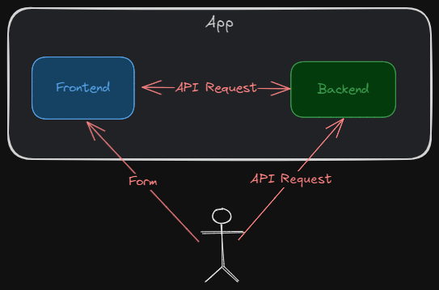

<style>
@import url('https://fonts.googleapis.com/css2?family=Prompt:ital,wght@0,100;0,300;0,400;0,700;1,100;1,300;1,400;1,700&display=swap');

    :root {
    font-family: Prompt;
    --hl-color: #D57E7E;
}
h1 {
  font-family: Prompt
}
</style>

# Fullstack Development

---

> Is your app safe?

---

[Source](https://x.com/bytebytego/status/1776127423320560051)


---

# Form and validation

---



---

# Case study

- `git clone -b no-check https://github.com/fullstack-67/fv-zod.git fv-no-check`

## Frontend (backend)

- `pnpm i`
- `npm run dev`

---

# Backend pitfalls (1)

- `GET` `/users` route
  - The response has `password` fields.

---

# Backend pitfalls (2)

- `POST` `/users` route

```json
{
  "firstName": "Test",
  "lastName": "Test",
  "email": "test@example.com",
  "dateOfBirth": "2024-01-01",
  "password": "1234",
  "confirmPassword": "1234"
}
```

- Try sending incomplete fields / wrong field names.
  - Internal error

---

# Backend pitfalls (3)

- Trying sending wrong year calendar.
  - Data is now not consistent.

---

# Frontend pitfalls (1)

`.env`

```bash
VITE_URL_DATA=/api/users_wrong
```

- Notice the incoming data

  - Key differences
  - Calendar year difference

- The wrong data causes blank/inconsistent display.

---

# Frontend pitfalls (2)

- Try using form
  - No input validation

---

# Wait, but I thought I used `TypeScript`.

- TypeScript catches compile-time errors.
- We are talking about **run-time** errors.

---

# We want

- Advanced/maintainable/scalable data validation
- Useful error message when validation fails
- Data sanitization (backend response)
- Logic reusability in frontend and backend codes
- Seamless combatibility with `TypeScript`
- API documentation

---

# Validation library

- `Zod`
- `Yup`
- `Typebox`

---

# `zod` basic

---

# Setup

- `git clone -b basic https://github.com/fullstack-67/fv-zod.git fv-basic`
- `pnpm i`
- `npm run dev`

---

# Validation with `zod`

---

# Setup

- `git clone -b check https://github.com/fullstack-67/fv-zod.git fv-check`

## Frontend (backend)

- `pnpm i`
- `npm run dev`

---

# Backend - schema

`./src/utils/schema.ts`

```ts
export const zUserBase = z.object({
  // Fields
});
// Response
export const zUsersRes = z.array(zUserBase.omit({ password: true }));
```

---

# Backend - data sanitization

```ts
// * Endpoint: get users
app.get("/users", (req, res) => {
  res.json(zUsersRes.parse(data)); // 👈👈👈
});
```

---

# Backend - validation middleware

```ts
export function validateData(schema) {
  return (req, res, next) => {
    try {
      schema.parse(req.body); // 👈👈👈
      next();
    } catch (error) {
      // Error logic
    }
  };
}
```

---

# Backend - data validation

`./src/index.ts`

```ts
app.post("/users", validateData(zUsersCreateReq), async (req, res, next) => {
  // Route logic
});
```

---

# Frontend - schema

- `./src/utils/schema.ts`
  - Same as backend schema.

---

# Frontend - validation

`./src/hooks/useUser.ts`

```ts
function useUsers() {
  // ...
  async function fetchUsers() {
    const res = await axios.get<User[]>(URL_DATA);

    // Validation from Zod
    const result = usersSchema.safeParse(res.data); // 👈👈👈

    if (!result.success) {
      // Error logic
    }
}
```

---

# Frontend - form validation

```ts
const FormVanilla: FC = () => {
  // ...
  async function sendData(e) {
    //...
    const result = formSchema.safeParse(values); // 👈👈👈
    if (!result.success) {
      // Show error message
    }
    // ...
  }
  return <div id="form"></div>; // Form stuff
};
```

---

# Try the form yourself

- http://10.10.12.140:5176
  - CMU Network only
  - Try `Form Vanilla` first

---

# Form UX improvement

- "Real-time" validation
- Disable submission button if input is not valid.
- Prevent double submission.
- Prevent typing during submission.
- Auto-focus the wrong input.

---

# Real-time validation

- Use `useEffect` to trigger schema validation
- Store errors in `errors` state.
- Keep track of when user touches the form.
  - Prevent premature validation.
  - Store `touch` state

---

# Submission button disabled

- Keep track of `valid` state.
- Keep track of `submission` state.

---

# Spiral out of control

- Too many states
- Too many logics
- Not reusable

---

# Form library

- Help you handle form states and logics in a reusable manner.

  - It is essentially a custom hook.
  - Integrates seemlessly with validation library.

- Popular libraries
  - `Formik`
  - `React Hook Form`

---

# Usage

```ts
import { useForm } from "react-hook-form";
//
const rhf = useForm<Form>({
  // Options
});

// Observer the states
console.log({ a_rhf: rhf, b_formState: formState, c_watch: watch() });
```

---

# UI Control

```ts
<input
  {...register("firstName")} // 👈👈👈
  type="text"
  id="firstName"
  disabled={isSubmitting}
/>
```

- Check `register("firstName")` in console.
  - This gives `onBlur`, `onChange`, `ref` to HTML element.

---

# Form validation

```ts
import { zodResolver } from "@hookform/resolvers/zod";
import { formSchema, type Form } from "../utils/schema";

const rhf = useForm<Form>({
  resolver: zodResolver(formSchema), // 👈👈👈
  defaultValues: getInitData(),
  mode: "onTouched",
});
```

- See `mode` [options](https://react-hook-form.com/docs/useform#mode)

---

# Generating documentation

> OpenAPI

---

# What is OpenAPI?

- API description format for REST APIs.

  - Formerly Swagger Specification

- An OpenAPI file allows you to describe your entire API.
  - Available endpoints
  - Operation parameters
  - Authentication methods

---

# What is Swagger?

- Open-source tools built around the OpenAPI Specification.
- Major Swagger tools include
  - [Swagger Editor](https://editor.swagger.io/?_gl=1*1qs02a5*_gcl_au*MTc4MTMwMDEyNy4xNzI2Mzc1MzU3) – browser-based editor
  - [Swagger UI](https://github.com/swagger-api/swagger-ui) – Library for rendering OpenAPI definitions as interactive documentation

---

# Example

- http://10.10.12.140:5175/api-docs
  - CMU network only

---

# Setup

- `git clone -b main https://github.com/fullstack-67/fv-zod.git fv-main`

---

# Highlight packages

```json
{
  "dependencies": {
    // ...
    "@asteasolutions/zod-to-openapi": "^7.1.1",
    "swagger-ui-express": "^5.0.1",
    "zod": "^3.23.8"
  }
}
```

---

# Extending `zod` object

`./src/openAPI.ts`

```ts
import { extendZodWithOpenApi } from "@asteasolutions/zod-to-openapi";
// ...
extendZodWithOpenApi(z);
```

`schema.ts`

```ts
export const zUserBase = z.object({
  id: z
    .string()
    // ...
    .openapi({ example: nanoid() }), // 👈👈👈
  // ...
});
```

---

# OpenAPI registry instance

```ts
import { OpenAPIRegistry } from "@asteasolutions/zod-to-openapi";
// ...
export const registry = new OpenAPIRegistry();
```

---

# Documentation from `zod` schema

`./src/index.ts`

```ts
registry.registerPath({
  method: "get",
  path: "/users",
  responses: {
    200: {
      content: {
        "application/json": {
          schema: zUsersRes, // 👈👈👈
        },
      },
    },
  },
});
app.get("/users", (req, res) => {
  // Route logic
});
```

---

# Route middleware

`./src/index.ts`

```ts
app.use(
  "/api-docs",
  swaggerUi.serve,
  swaggerUi.setup(getOpenApiDocumentation())
);
```

---

# OpenAPI genenerator

`./src/openAPI.ts`

```ts
export function getOpenApiDocumentation() {
  const generator = new OpenApiGeneratorV3(registry.definitions);
  return generator.generateDocument({
    // Options
    openapi: "3.0.0",
    info: {
      version: "1.0.0",
      title: "My API",
      description: "This is the API.",
    },
    servers: [{ url: "/" }],
  });
}
```
