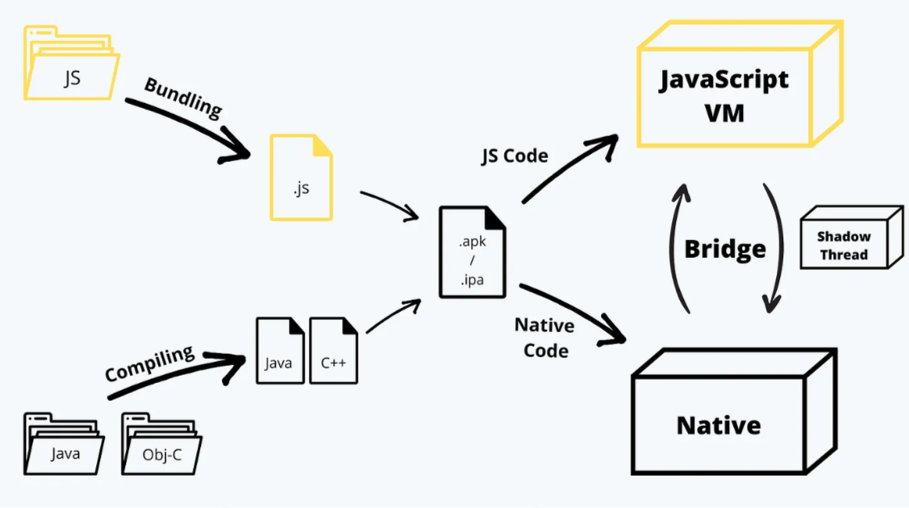

<style>
@import url('https://fonts.googleapis.com/css2?family=Prompt:ital,wght@0,100;0,300;0,400;0,700;1,100;1,300;1,400;1,700&display=swap');

    :root {
    font-family: Prompt;
    --hl-color: #D57E7E;
}
h1 {
  font-family: Prompt
}
</style>

# Fullstack Development

---

# Mobile development: React Native

---

# Case study 1

- **Your boss**: _I need you to make a counter app for me right now._
- **You**: _Sure, give me .... minutes._

---

# Expo

### The fastest way to make "counter" app materialize on your phone.

---

# Assume

- You know React.
- You and your boss have Android phones.

---

# Setup

- Create Expo account.
- Install required CLI tool / authenticated
  - `npm install -g eas-cli`
  - `eas login`

---

# Steps

- `npx create-expo-app -t expo-template-blank-typescript`
- `npx expo install expo-updates` (For OTA update)
- `npm start`
- Scan QR code using `Expo Go`

---

`App.tsx`

```ts
import { StatusBar } from "expo-status-bar";
import { StyleSheet, Text, View, Button } from "react-native";
import { useState } from "react";
export default function App() {
  const [count, setCount] = useState(0);
  return (
    <View style={styles.container}>
      <StatusBar backgroundColor="blue" />
      <Text style={{ fontSize: 50 }}>Counts: {count}</Text>
      <Button onPress={() => setCount((c) => c + 1)} title="Add" />
      <Button onPress={() => setCount(0)} title="Reset" color="red" />
    </View>
  );
}

const styles = StyleSheet.create({
  container: {
    flex: 1,
    backgroundColor: "#fff",
    alignItems: "center",
    justifyContent: "center",
    gap: 10,
  },
});
```

---

# Build

- `eas init`
- `eas update:configure`
- `eas build:configure`
- `eas build --platform android --profile preview`

---

# Update

- `eas update --branch preview --message "Fix typo"`

---

# Case study 2

- **Your boss**: _I need you to make a mirror app for me right now._
- **You**: _Sure, give me .... minutes._

---

# Initialize a project

- `npx create-expo-app -t expo-template-blank-typescript`
- `npx expo install expo-updates expo-camera`
- `npm install nativewind`
- `npm install -D tailwindcss@3.3.2`
- `npx tailwindcss init`

---

# Configuring TailwindCSS

`./tailwind.config.js`

```js
/** @type {import('tailwindcss').Config} */
// tailwind.config.js
module.exports = {
  content: [
    "./App.{js,jsx,ts,tsx}",
    "./<custom directory>/**/*.{js,jsx,ts,tsx}",
  ],
  theme: {
    extend: {},
  },
  plugins: [],
};
```

---

# Configuring TailwindCSS

`./babel.config.js`

```js
module.exports = function (api) {
  api.cache(true);
  return {
    presets: ["babel-preset-expo"],
    plugins: ["nativewind/babel"],
  };
};
```

---

# Add types

`./nativewind-env.d.ts`

```js
/// <reference types="nativewind/types" />
```

---

# Permission

`./app.json`

```json
{
  "expo": {
    ...
    "plugins": [
      [
        "expo-camera",
        {
          "cameraPermission": "Allow $(PRODUCT_NAME) to access your camera."
        }
      ]
    ]
    ...
  }
}
```

---

# Main application

`./App.tsx`
https://github.com/fullstack-67/rn-mirror/blob/main/App.tsx

---

# Build and deploy

- `eas init`
- `eas update:configure`
- `eas build:configure`
- `eas build --platform android --profile preview`

---

# Overview of mobile development

---

# Mobile development

- Native
  - Andriod: Java or Kotlin
  - iOS: Objective-C or Swift
- Cross-platform
  - React Native: JavaScript
  - Flutter: Dart

---

# Native vs cross-platform

|                | Native | Cross-Platform |
| -------------- | ------ | -------------- |
| Time to market | Slow   | Fast           |
| Features       | Full   | Limited        |
| Performance    | More   | Less           |
| Cost           | More   | Less           |

---

# React Native vs Flutter

- [Popularity](https://survey.stackoverflow.co/2024/technology/#1-other-frameworks-and-libraries)

---

# React Native vs Flutter

|             | React Native                 | Flutter          |
| ----------- | ---------------------------- | ---------------- |
| Language    | JavaScript                   | Dart             |
| UI          | Native UI and iOS components | Custom widget    |
| Dev API     | Core + 3rd party libs        | Core             |
| Dev option  | More versatile               | More streamlined |
| Performance | Slower                       | Faster           |

[Source](https://www.sam-solutions.com/blog/flutter-vs-react-native/)

---

# React Native


---

# React Native architecture


[Source](https://medium.com/front-end-weekly/how-does-react-native-work-understanding-the-architecture-d9d714e402e0)

---

# But what is Expo?

- Expo is a set of tools and services built around React Native.
- From React Native official doc:
  > If you are new to mobile development, the easiest way to get started is with Expo Go.

---

# Expo position


---

# Expo ecosystem

- **Expo SDK**
  - Framework for building React Native apps.
- **Expo Go**
  - App that makes testing apps easy via a scannable QR code.
- **Expo Dev Clients**
  - A framework to extend Expo Go.
- **Expo Application Services (EAS)**
  - Freemium services for building and submission.

---

# Todo app

`git clone git@github.com:fullstack-67/rn-todo.git`
[APK](https://drive.google.com/drive/folders/1UvU8yCrvvoYR91I7wVHBYfcgyjMh490k?usp=drive_link)

---

# Expo router

- File-base routing.
  - `/app` folder
- `_layout.tsx` for layout


---

`/app/todo/_layout.tsx`

```js
const AboutMenu = () => {
  return (
    // 👇👇👇👇👇👇👇👇👇
    <Link href="/todo/about">
      <TouchableOpacity onPress={() => {}} style={{ paddingRight: 10 }}>
        <Ionicons
          name="help-circle-outline"
          size={32}
          color={COLORS.lightWhite}
        />
      </TouchableOpacity>
    </Link>
  );
};
```

---

# Main navigation (tab)

`/app/_layout.tsx`

```tsx
export default function AppLayout() {
  return (
    <View ...>
      <Tabs screenOptions={...}>
        <Tabs.Screen name="index" options={...}/>
        <Tabs.Screen name="todo" options={...}/>
      </Tabs>
    </View>
  );
}
```

---

# Secondary navigation (stack)

`/app/todo/_layout.tsx`

```tsx
export default function TodoLayout() {
  return (
    <Stack screenOptions={...} >
      <Stack.Screen name="index" options={...} />
      <Stack.Screen name="about" options={} />
    </Stack>
  );
}

```

---

# Styling

- Cannot use CSS.
- All of the core components accept a prop named `style`.
- The style names and values usually match how CSS works on the web.
- Default behavior is `flex-column`

---

# Styling

`./app/index.tsx`

```tsx
import { StyleSheet } from "react-native";
// ...
export default function Home() {
  return <View style={styles.container}>...</View>;
}

const styles = StyleSheet.create({
  container: {
    flex: 1,
    backgroundColor: "#fff",
    alignItems: "center",
    justifyContent: "center",
    fontFamily: "Prompt",
  },
});
```

---

# Style library

- [Native Base](https://nativebase.io/)
- [Native Wind](https://www.nativewind.dev/)

---

# I just want to press something...

- `Button`
- `TouchableOpacity`
- `TouchableHighlight`
- `TouchableWithoutFeedback`
- `TouchableNativeFeedback`
- `Pressable`

---

# TouchableOpacity

`./components/TodoForm.tsx`

```tsx
import { TouchableOpacity } from "react-native";

const TodoForm: FC<Props> = ({ txt, setTxt, addTodo }) => {
  return (
    // ...
      <TouchableOpacity style={...} onPress={...}>
        <Ionicons ... />
      </TouchableOpacity>
  );
};

export default TodoForm;
```

---

# I just want to see a list.

- `ScrollView`
- `FlatList`
- `SectionList`
- `VirtualizedList`
- `VirtualizedSectionList`

---

`./component/TodoList.tsx`

```tsx
import {  ListRenderItemInfo, FlatList }

const TodoList: FC<Props> = (props) => {
  const renderTodo = ({ item }: ListRenderItemInfo<Todo>) => (
    <TodoItem todo={item} deleteTodo={props.deleteTodo} />
  );

  return (
    <View style={styles.container}>
      <FlatList
        data={props.todos}
        renderItem={renderTodo}
        keyExtractor={(todo: Todo) => todo.id.toString()}
        ItemSeparatorComponent={Separator}
      />
    </View>
  );
};


```

---

# Icon and splash screen

- [Template](<https://www.figma.com/file/kiE0nTaVWKVtw1GGFRQ4wz/Expo-App-Icon-%26-Splash-(Community)?type=design&node-id=0%3A1&mode=design&t=l8DdJnVzFg4FzkbI-1>)

## 

---

# Business logic

### Plain old React

---

`./app/todo/index.tsx`

```tsx
import { useState, useEffect } from "react";
import axios from "axios";
export default function Todo() {
  const [todos, setTodos] = useState<Todo[]>([]);

  function deleteTodo(id: number) {...}
  function addTodo(txt: string) {...}

  useEffect(() => {
    axios
      .get("https://jsonplaceholder.typicode.com/todos")
      .then((res) => {
        setTodos(res.data.slice(0, 10));
      })
  }, []);

  return (...);
}
```

---

`./components/TodoForm.tsx`

```tsx
interface Props {
  txt: string;
  setTxt: (txt: string) => void;
  addTodo: (txt: string) => void;
}

const TodoForm: FC<Props> = ({ txt, setTxt, addTodo }) => {
  return (
    //...
    <TextInput onChangeText={(t) => setTxt(t)} value={txt} />
    <TouchableOpacity onPress={() => {addTodo(txt);}}>
    //...
    </TouchableOpacity>
    //...
  );
};

```

---

# Deployment

- `Profile`
- `Channel`
- `Branch`

---

# Channel and branch


---

# Build

`./eas.json`

```json
{
  "build": {
    "development": {
      "developmentClient": true,
      "distribution": "internal",
      "channel": "development"
    },
    "preview": {
      "channel": "preview",
      "distribution": "internal"
    },
    "production": {
      "channel": "production"
    }
  }
}
```

---

# Build

- `eas build --platform android --profile preview`

---

# Inspect

- `eas channel:list`
- `eas branch:list`

---

# Update

- `eas update --branch preview --message "Fix typo"`

---

# 🦀 Takeaway

### Choose React Native if

- You and your team know React.
- Your business **differentiator** is not mobile applications.
- You don't have time and/or budget.
