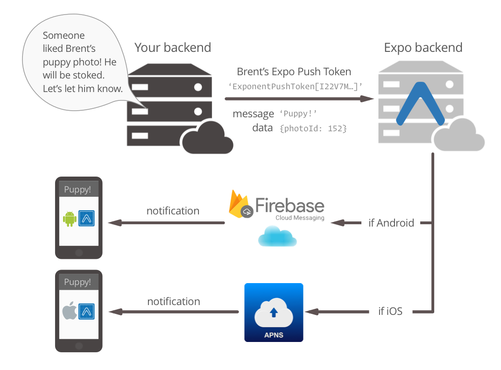

<style>
@import url('https://fonts.googleapis.com/css2?family=Prompt:ital,wght@0,100;0,300;0,400;0,700;1,100;1,300;1,400;1,700&display=swap');

    :root {
    font-family: Prompt;
    --hl-color: #D57E7E;
}
h1 {
  font-family: Prompt
}
</style>

# Fullstack Development

---

# React Native Services

> Camera | Location | Sensor | Notification

---

# Case study

- **Your boss**: _I need you to make a mirror app for me right now._
- **You**: _Sure, give me .... minutes._

---

# Initialize a project

- `npx create-expo-app -t expo-template-blank-typescript`
- `npx expo install expo-updates expo-camera`

---

`./app.json`

```json
{
  "expo": {
    ...
    "plugins": [
      [
        "expo-camera",
        {
          "cameraPermission": "Allow $(PRODUCT_NAME) to access your camera."
        }
      ]
    ]
    ...
  }
}
```

---

`./App.tsx`

```tsx
import { View, Button, SafeAreaView } from "react-native";
import { Camera, CameraType } from "expo-camera";
import { useState } from "react";
export default function App() {
  const [open, setOpen] = useState(false);
  const [cameraPermission, requestCameraPermission] =
    Camera.useCameraPermissions();

  // Camera is still loading
  if (!cameraPermission) return <View />;

  // Ask for permission
  if (!cameraPermission.granted) {
    return (
      <View style={{ flex: 1, justifyContent: "center" }}>
        <Button
          onPress={requestCameraPermission}
          title="We need your permission."
        />
      </View>
    );
  }

  // return (...)
}
```

---

```ts
return (
  <SafeAreaView style={{ flex: 1, paddingVertical: 40 }}>
    <Button onPress={() => setOpen((prev) => !prev)} title="Toggle" />
    {open ? (
      <Camera
        style={{ flex: 1 }}
        type={CameraType.front}
        onCameraReady={() => setOpen(true)}
      />
    ) : null}
  </SafeAreaView>
);
```

---

# Build and deploy

- `eas init`
- `eas update:configure`
- `eas build:configure`
- `eas build --platform android --profile preview`

---

# Camera app

https://github.com/fullstack-66/expo-camera

---

# Nativewind

`./utils/nativewind-styled.ts`

```tsx
import { View } from "react-native";
import { styled } from "nativewind";

export const StyledView = styled(View);
```

`./app/index.tsx`

```tsx
<StyledView className="bg-purple-800 flex-1 items-center justify-center">
  ...
</StyledView>
```

---

# Some inconveniences

- Cannot wrap `styled` with `Button` component.
  - Does not have `style` attribute.
- Version conflict

```json
{
  "dependencies": {
    "expo": "~49.0.8",
    "nativewind": "^2.0.11"
  },
  "devDependencies": {
    "tailwindcss": "^3.3.2" // Not 3.3.3
  }
}
```

---

# Camera mounting/unmounting problem

> Only one Camera preview can be active at any given time. If you have multiple screens in your app, you should unmount Camera components whenever a screen is unfocused.

---

`./app/camera/index.tsx`

```tsx
import { useIsFocused } from "@react-navigation/native";

export default function App() {
  // Use this to render camera when the screen is focused.
  const isFocused = useIsFocused();

  if (!isFocused) return <StyledView />;

  // Render camera here
  // return ...;
}
```

---

# Taking picture

- Get reference

`./camera/index.tsx`

```tsx
const cameraRef = useRef<Camera>(null);

return <Camera ref={cameraRef}>...</Camera>;
```

---

```ts
async function takePicture() {
  if (!cameraRef.current) return;
  let options = {
    quality: 1,
    base64: true,
    exif: false,
  };

  try {
    let newPhoto = await cameraRef.current.takePictureAsync(options);
    setPicture(newPhoto);
    router.push("/camera/review");
  } catch (err) {
    alert(JSON.stringify(err));
  }
}
```

The photo is actually stored locally.

---

# Saving photo

`./app/camera/review.tsx`

```tsx
import * as MediaLibrary from "expo-media-library";

export default function Review() {
  const [mediaPermission, requestMediaPermission] =
    MediaLibrary.usePermissions();

  function savePhoto() {
    MediaLibrary.saveToLibraryAsync(picture!.uri).then(() => {
      setPicture(null);
      //...
    });
  }
  //...
}
```

---

# Furthermore

- `onBarCodeScanned`
  - Callback that is invoked when a bar code has been successfully scanned.
- `onFacesDetected`
  - Callback invoked with results of face detection on the preview.

---

# Location app

https://github.com/fullstack-66/expo-location

---

# Location on mobile

- GPS
  - Using satellites
  - High power usage
  - High accuracy
  - Slow
- Network
  - Using assisted GPS, cell tower, WiFi access point
  - Less battery usage
  - Medium-high accuracy
  - Fast

---

# Location on mobile (cont)

- Passive
  - Using cell tower, WiFi access point
  - Special provider for receving location without initiation.
  - No extra battery usage
  - Low-medium accuracy
  - Very fast

[Source](https://developerlife.com/2010/10/20/gps/)

---

# Reverse geocoding

- Process of converting geographic coordinates (latitude, longitude) to a human-readable address or place name.
- Opposite of forward geocoding
  - Often referred to as address geocoding or simply "geocoding".

---

# Permission

`./app/_layout.tsx`

```tsx
import * as Location from "expo-location";

export default function AppLayout() {
  const [locationPermission, requestPermission] =
    Location.useForegroundPermissions();

  if (!locationPermission) return <StyledView />;
  if (!locationPermission.granted) {
    return (...);
  }
}
```

---

# Provider information

`./app/_layout.tsx`

```ts
import useStore from "../utils/store";
import { useIsFocused } from "@react-navigation/native";

export default function AppLayout() {
  const [setProviderStatus] = useStore((state) => [state.setProviderStatus]);

  const isFocused = useIsFocused();

  useEffect(() => {
    Location.getProviderStatusAsync().then((status) => {
      setProviderStatus(status);
    });
  }, [isFocused]);
}
```

---

# Get manual location and geocode

`./app/index.tsx`

```ts
async function getCurrentLocation() {
  try {
    const location = await Location.getCurrentPositionAsync({});
    setLocation(location);
    const { latitude, longitude } = location.coords;
    const geoCodes = await Location.reverseGeocodeAsync({
      latitude,
      longitude,
    });
    setGeoCodes(geoCodes);
  } catch (err) {
    alert(JSON.stringify(err));
  }
}
```

---

# Subscribe for location change

- `watchPositionAsync`

---

`./app/watch-location.tsx`

```ts
useEffect(() => {
  if (isFocused) {
    const locationOptions = {
      accuracy: Location.Accuracy.High,
      distanceInterval: 10,
    };

    Location.watchPositionAsync(locationOptions, (location) => {
      // Set location and geocode here
    }).then((sub) => {
      // Save subscription to a ref
      locationSubscrition.current = sub;
    });
  }
  return () => {
    // Unsubscribe when unfocused
    if (locationSubscrition.current) {
      locationSubscrition.current.remove();
    }
  };
}, [isFocused]);
```

---

# Sidenote: SDK conflict

- Need to downgrade to SDK48
  - `npx create-expo-app -t expo-template-blank-typescript@48`

```json
{
  "dependencies": {
    "expo": "^48.0.0",
    "expo-location": "~15.1.1",
    "nativewind": "^2.0.11"
  },
  "devDependencies": {
    "tailwindcss": "^3.3.1" // Not 3.3.2 or 3.3.3
  }
}
```

---

# Sidenote: `gap` problem in Nativewind

- `gap` property in Nativewind interferes with that in `React Native` ([issue](https://github.com/marklawlor/nativewind/issues/386)).
- Need to use `gap` in `style` attribute.

```tsx
<StyledView
  className="flex-1 justify-start items-center mt-10"
  style={{ gap: 30 }}
>
```

---

# Furthermore

- Background location
  - `startLocationUpdatesAsync`
  - Registers for receiving location updates that can also come when the app is in the background.
- Geofencing
  - `startGeofencingAsync`
  - Starts geofencing for given `regions`. When the new event comes, the task with specified `name` will be called with the region that the device enter to or exit from.

---

# Furthermore

- Expo `MapView` library
  - Google Maps / Apple Maps
  - Need API keys from Google / Apple when deploying.

---

# Sensor app

https://github.com/fullstack-66/expo-sensors

---

```tsx
import { Accelerometer, AccelerometerMeasurement } from "expo-sensors";

export default function App() {
  const _subscribe = () => {
    setSubscription(Accelerometer.addListener(setData));
  };

  const _unsubscribe = () => {
    subscription && subscription.remove();
    Accelerometer.removeAllListeners();
    setSubscription(null);
  };
}
```

---

# Update interval

```tsx
const _slow = () => Accelerometer.setUpdateInterval(1000);
const _fast = () => Accelerometer.setUpdateInterval(100);
```

---

# Other sensors

```tsx
import {
  Accelerometer,
  Barometer,
  DeviceMotion,
  Gyroscope,
  LightSensor,
  Magnetometer,
  MagnetometerUncalibrated,
  Pedometer,
} from "expo-sensors";
```

---

# Sidenote: SDK problem

- Need to use SDK 47

```json
{
  "dependencies": {
    "expo": "~47.0.14",
    "expo-sensors": "~12.0.1",
    "nativewind": "^2.0.11"
  },
  "devDependencies": {
    "tailwindcss": "^3.3.1" // Not 3.3.2 or 3.3.3
  }
}
```

---

# Notification

https://github.com/fullstack-66/expo-push

---

# Push notification

- Services offered by
  - Firebase Cloud Messaging (FCM)
  - Apple Push Notification Service (APNs)
- This is quite a hassle.
- Expo unifies the way we handle push notification.
  - Provide unified abstraction through client \ server SDKs

---



---

# Get your app ready to be "pushed"

`./App.tsx`

```tsx
useEffect(() => {
  registerForPushNotificationsAsync().then((token) => setExpoPushToken(token));
  //...
}, []);
```

---

`./utils/notification-utils.ts`

```ts
export async function registerForPushNotificationsAsync() {
  // ...

  if (Device.isDevice) {
    // Get permission
    const { status: existingStatus } =
      await Notifications.getPermissionsAsync();
    // ...
    // Get token
    const token = await Notifications.getExpoPushTokenAsync({
      projectId: Constants.expoConfig.extra.eas.projectId,
    });
  }
}
```

---

# Notification event

- Expo provides many listeners for notification events
  - [List](https://docs.expo.dev/versions/latest/sdk/notifications/#notification-events-listeners)
- We will implement
  - `NotificationReceivedListener` (Foreground)
  - `NotificationResponseReceivedListener` (Background & Killed)

---

```ts
useEffect(() => {
  notificationListener.current = Notifications.addNotificationReceivedListener(
    (notification) => {
      setNotification(notification); //For display
    }
  );

  responseListener.current =
    Notifications.addNotificationResponseReceivedListener((response) => {
      setNotificationResponse(response); // For display
    });

  return () => {
    // Remove listeners
  };
}, []);
```

---

# Sending notifications

- Mobile
  - `expo-notifications` library
- [HTTP API](https://docs.expo.dev/push-notifications/sending-notifications/#http2-api)
  - `POST` request
- [Push API (Server SDK)](https://docs.expo.dev/push-notifications/sending-notifications/#send-push-notifications-using-a-server)

---

# Mobile

`./utils/notification-utils.ts`

```ts
export async function schedulePushNotification() {
  // Generate data
  // ...
  await Notifications.scheduleNotificationAsync({
    content: {
      title: `You've got ${product} for $${price}`,
      body: text,
      data: data,
    },
    trigger: { seconds: 2 },
  });
}
```

---

# HTTP API

- `POST` https://exp.host/--/api/v2/push/send

Header

```
host:exp.host
accept:application/json
accept-encoding:gzip, deflate
content-type:application/json
```

---

Body

```json
{
  "to": "ExponentPushToken[XXXXXXXX]",
  "title": "Hello World",
  "body": "Greeting from Postman",
  "data": {
    "test": "test data"
  }
}
```

---

# Deployment

- If using `Expo Go`, push notification works out-of-the-box.
- For a deployed app, we need to register for
  - `Firebase Cloud Messaging` service key and/or `Apple Push Notifications` service key
  - Follow additional steps through the [instructions](https://docs.expo.dev/push-notifications/push-notifications-setup/).

---

# Sidenote: SDK problem

- Need to use SDK 48

```json
{
  "dependencies": {
    "expo": "~48.0.18",
    "expo-notifications": "~0.18.1",
    "nativewind": "^2.0.11"
  },
  "devDependencies": {
    "tailwindcss": "^3.3.1" // Not 3.3.2 or 3.3.3
  },
  "private": true
}
```
