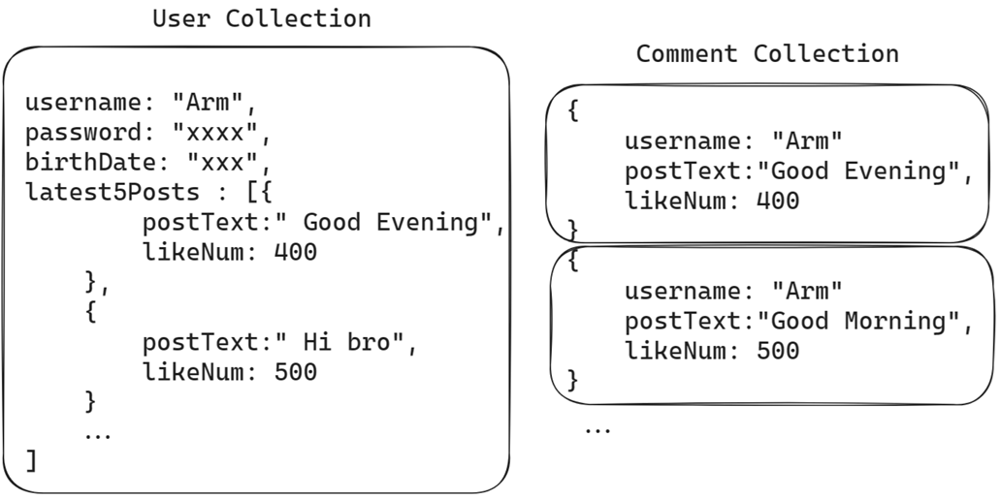
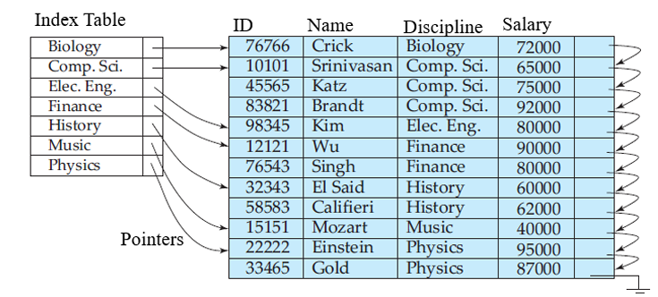

<style>
@import url('https://fonts.googleapis.com/css2?family=Prompt:ital,wght@0,100;0,300;0,400;0,700;1,100;1,300;1,400;1,700&display=swap');

    :root {
    font-family: Prompt;
    /* --hl-color: #D57E7E; */
}
h1 {
  font-family: Prompt
}
</style>

# Fullstack Development

---

# Database Design

---

# Content

- Database ranking
- SQL database
- NoSQL database
- Schema patterns
- Some useful information

---

# Database Engine Ranking

- Database engine
  - DBMS (Database Management System)
- [A brief history of databases](https://www.cockroachlabs.com/blog/history-of-databases-distributed-sql/)
- [DB-Engines Ranking](https://db-engines.com/en/ranking)

---

# SQL Database

- Relational database
- Organize data into `tables` of related information
- Utilize `Structured Query Language (SQL)` for managing/manipulating data

---

# SQL Database


---

# Popular RDBMS

- Open source: [MySQL](https://www.mysql.com/), [PostgreSQL](https://www.postgresql.org/)
- Commercial: [Oracle Database](https://www.oracle.com/database/), [Microsoft SQL Server](https://www.microsoft.com/en-us/sql-server), [IBM DB2](https://www.ibm.com/products/db2)
- [RDBMS Ranking](https://db-engines.com/en/ranking/relational+dbms)

---

# SQL

The standard language used to interact with SQL databases

- Data Definition Language (DDL)
  - e.g., `CREATE TABLE`, `ALTER TABLE`, `DROP TABLE`
- Data Manipulation Language (DML)
  - e.g., `INSERT`, `UPDATE`, `DELETE`, `SELECT`
- Data Control Language (DCL)
  - e.g., `GRANT`, `REVOKE`

---

# ACID Properties

- An acronym that stands for ...
  - `Atomicity`
  - `Consistency`
  - `Isolation`
  - `Durability`
- Ensure reliable transaction processing and data integrity
- [What does ACID Means?](https://medium.com/nerd-for-tech/understanding-acid-properties-in-database-management-98243bfe244c)

---

# NoSQL

- `non SQL` or `not only SQL`
- Store data in a format other than relational tables
- Mostly designed for high `scalability` and `availability`

---

# Types of NoSQL Database

- Document-oriented
- Column-oriented
- Graph-based
- Key-Value pair
- Time series

---

# Document Database

- The data is stored in `document`
- Each `document` is typically a `nested structure` of `keys` and `values`
- **Possible to retrieve only parts of a document**
- The most commonly used data format are `JSON`, `BSON`, and `XML`
- e.g., [MongoDB](https://www.mongodb.com/), [Apache CouchDB](https://couchdb.apache.org/)

---

# Document Database


---

## Document Database: Terminology


---

# Wide Column Data Store

- Store data in columns rather than rows
- Able to store large amounts of data in a single column
- Allows to reduce disk resources and the time to retrieve information
- Highly scalable and flexible
- e.g., [Apache Cassandra](https://cassandra.apache.org/_/index.html)

---

# Wide Column Data Store


---

# Graph Database

- Store and query highly connected data
- Data are modeled in the form of **entities** (`nodes`) and **relationships** (`edges`) between them
- Able to traverse from `nodes` or `edges` along defined relationship types until reaching some `defined condition`
  - Results : `lists`, `maps`, or graph `traversal path`
- e.g., [Neo4j](https://neo4j.com/)

---

# Graph Database


---

# Time Series Database

- Store and retrieve data records that are **sequenced by `time`**
  - Sets of data points associated with `timestamps` and stored in time sequence order
- Easy to measure how data change over time (e.g., IoT application)
- e.g., [InfluxDB](https://www.influxdata.com/), [Prometheus](https://prometheus.io/)

---

# Time Series Database


---

# Key-value Data Store

- Stores data as a collection of `key-value pairs`
- Each data item is identified by a `unique key`
- The `value` can be anything (string, number, object, ...)
- e.g., [Redis](https://redis.io/), [Memcached](https://memcached.org/)

---

# Key-value Data Store


---

# CAP Theorem

In a distributed data system, it is impossible to simultaneously guarantee all of these properties:

- **C** : `Consistency`
- **A** : `Availability`
- **P** : `Partition Tolerance`

[Many NoSQL databases are **AP** systems](https://samaratungajs.medium.com/cap-theorem-nosql-databases-956e192893a6)

---

# CAP Theorem


---

# Database Schema

---

# What is Database Schema?

- DB Schema defines how data is organized within the databasae
- Outlining how data is logically stored
- **Key components**:
  - Tables, Columns, Data types, Constraints
  - Primary / Foreign keys
  - Relationships (`one-to-one`, `one-to-many`, `many-to-many`)

---

## Relationship : One-to-Many

e.g., **"Social media status post"**


- A `Post` may have many `comments`
- A `comment` belongs to only one `Post`

---

## SQL Schema : One-to-Many


---

## SQL Query : One-to-Many

e.g., **"Get a `Post` together with its `Comments`"**


SELECT \* FROM `Post` JOIN `Comment` ON `Post.Id` = `Comment.postId`;

---

## NoSQL Schema #1 : One-to-Many

**Option 1** - Embedding `Comments` as array in `Post` document

- Assuming that a `Post` has <u>less than a hundred</u> `Comments`


---

## NoSQL Schema #2 : One-to-Many

**Option 2** - Reference to other collections, avoiding massive array


- Reference each `Comment` to a single `Post`
- What if a `Post` may have thousands of `Comments`

---

# Summary : One-to-Many

#### SQL

- Create two tables with a `foreign key` (representing a relationship)

#### NoSQL

- Embedding an `array of objects` in `another type of object`
- References multiple `objects` to `another type of object`

---

## Relationship : Many-to-Many

e.g., **"Students Enrollment"**


- A `Student` may enroll in multiple `Courses`
- A `Course` is enrolled by many `Students`

---

## SQL Schema : Many-to-Many


---

## SQL Query : Many-to-Many

e.g., **"Get all `Courses` title enrolled by a `Student` with specified `studentId`"**


---

## SQL Query : Many-to-Many

e.g., **"Get all `Courses` title enrolled by a `Student` with specified `studentId`"**


---

## NoSQL Schema #1 : Many-to-Many

**Option 1** - Embedding a list of `Courses` in a `Student` document


---

## NoSQL Query #1 : Many-to-Many

e.g., **"Which `Students` enroll in my `Course`"**


---

## NoSQL Schema #2 : Many-to-Many

**Option 2** - Embedding a list of `Students` in a `Course` document


---

## What if we want both?


---

## NoSQL Schema #3 : Many-to-Many

**Option 3** - Embedding a list of `References` in both documents


- `Pros` : query efficiently from both sides
- `Cons` : duplicate data, need to update on both side

---

# Summary : Many-to-Many

#### SQL

- Create **three** tables with `foreign keys` and `JOIN` them together

#### NoSQL

- Choose which side of document to be embedded by <u>determining which side has more queries</u>
- Embedded on both sides and apply `data mutation` very carefully

---

# Data Integrity

---

# SQL Data Integrity

[Foreign Key]()

- Keeps data consistent across related tables


---

# SQL Data Integrity

[Data Normalization](https://www.sqlshack.com/what-is-database-normalization-in-sql-server/)

- The process of restructuring a relational database
- Helps reducing `data redundancy` (multiple copies of the same data)
- Improves `data integrity` by <u>avoiding updating data in multiple locations</u>

---

## Data Normalization


---

## Data Normalization


---

## How far to take normalization in SQL database?

- This question is **opinion-based**
- Query \*_more tables_ is typically slower (due to more `JOIN` operations)
- Normalize as far as necessary to **remove data integrity issues**
  - Potential data duplication or missing data

---

## Data normalization in NoSQL database

- NoSQL prefers `denormalization`
  - Accept data duplication to improve querying speed
  - `Insert` / `Update` / `Delete` must be performed carefully
- No `foreign key` mechanism built-in

---

# Schema and Data Type Safety

---

## Schema validation

- **SQL** has built-in schema and data type validation (duhh!!!)
- **NoSQL** database usually allows you to annotate and validate JSON documents
  - `MongoDB` uses `JSON schema` to specify validation rules when creating a collection
- Some `ORMs` can be used to defines a schema for **NoSQL**
  - This ORM helps validating data during coding
  - `Prisma ORM` defines a schema for `MongoDB`, providing type safety
  - Unfortunately, `Drizzle` <u>does not natively support MongoDB</u>

---

## MongoDB JSON Schema


---

## Prisma ORM Schema


---

# Common Database Patterns

---

# Soft DELETE

To delete a row, marks the `status` field as `false`.


---

# Soft DELETE

**`Pros`**

- Able to view history of data
- Sensitive data remains in the database
- Undeletion is possible

**`Cons`**

- Every query must has `where status = true` condition
- `Size` of **table / collection** is larger

---

# Created-At and Updated-At

"Tracking **`when`** a row was **created** or **updated**"


---

# Created-By and Updated-By

"Tracking **`who`** has interacted with the data"


---

# NoSQL Pattern

---

## Example: Social media latest [#] posts

"Get the latest [#] Posts of specified User in one query"


---

## Example: Social media latest [#] posts



---

# Database Index

---

# What is Index?

- A **data structure** that <u>improves the speed of data retrieval operations</u> on `database table`
- `Index` costs **additional writes** and **storage space** to maintain the index data structure

---

# [Index Example](https://medium.com/@soham274/indexing-in-databases-29dc5b7ce634)

"Get `instructors` with `Finance` discipline"



---

# [Index Example](https://medium.com/@soham274/indexing-in-databases-29dc5b7ce634)

"Get `instructors` ordered by `Salary`"


---

# Composite Index

"Get `Customers` ordered by `Name` and `Town`"


---

# Unique Index

- Unique index is used to <u>ensure data uniqueness</u>
- e.g., To ensure that a `Student` cannot enroll the same `Course` twice
  - Create a **`compound unique index`** containing `studentId` and `courseNo`


---

# Index Summary

**`Pros`**

- Query data more efficiently, speed up `SELECT` operation

**`Cons`**

- <u>Index must be rebuilt</u> when `INSERT` / `UPDATE` / `DELETE`, hence slower
- Index requires <u>addtional storage space on database</u>

---

# Unique Identifier

- A value that <u>distinquishes a **specific record** (row, document) from others within the table</u>
- Prevent ambiguity and enabling efficient data retrieval and management

---

# Auto Increment ID

SQL database only

- MySQL uses the `AUTO_INCREMENT` keyword

```sql
CREATE TABLE table_name (
    id INT AUTO_INCREMENT PRIMARY KEY,
    column2 VARCHAR(255),
    column3 INT,
    -- Add other columns as needed
);
```

---

# Auto Increment ID

- PostgreSQL uses the `SERIAL` or `SEQUENCE` keywords

```sql
CREATE TABLE my_table (
    id SERIAL PRIMARY KEY,
    name VARCHAR(255)
);
```

```sql
CREATE SEQUENCE my_sequence START 100 INCREMENT 5;

CREATE TABLE another_table (
    id INTEGER NOT NULL DEFAULT nextval('my_sequence'),
    description TEXT
);

ALTER SEQUENCE my_sequence OWNED BY another_table.id;
```

---

# UUID

**Universally Unique ID**

- Not able to find the same `UUID` in the same Universe
- The term **Globally Unique Identifier** (`GUID`) is also used
  - Used mostly in Microsoft systems
- `UUID 4` is widely used

---

# UUID v4

- The most commonly used and recommended for general-purpose applications
  - Due to its **simplicity** and reliance on **pseudo-random number generator**
- 128-bit value (32-Hexadecimal)
- Formated as 5-group of characters (8-4-4-4-12)

## <center>c9b135f6-f163-<span style="color: red;">4</span>0d6-8483-0a57780e3f17</center>

---

# What to use as Primary Keys?

[Auto-increment IDs vs. UUIDs ?](https://blog.codinghorror.com/primary-keys-ids-versus-guids/)


---

# UUID Pros and Cons

**Pros**

- Unique across every table, database, every server
- Easy merging of records form different databases
- Easy distribution of databases across multiple servers, aka. **sharding**

**Cons**

- Larger than tradition typically ID
- This can have serious performance and storage implications
- May be difficult to debug
  `... where userid = ‘{BAE7DF4-DDF-3RG-5TY3E3RF456AS10}’`

---

# MongoDB Object ID

- Insert automatically in every document
- Embedded `timestamp` inside the ID > Can be used to sort as `create date`

```javascript
[
  {
    _id: ObjectId("62bb413014b92d148400f7a5"),
    name: "Alice",
    year: 2019,
    major: "History",
    gpa: 3,
    address: { city: "NYC", street: "33rd Street" },
  },
];
```
