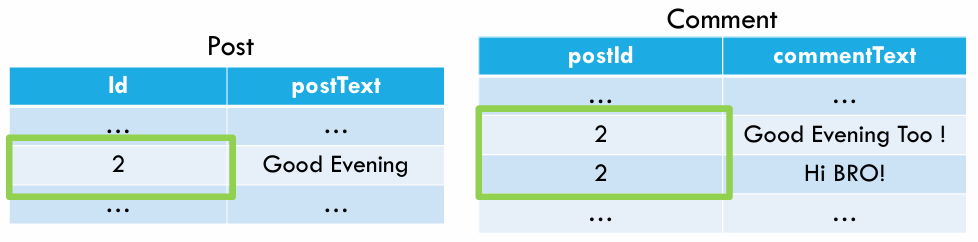
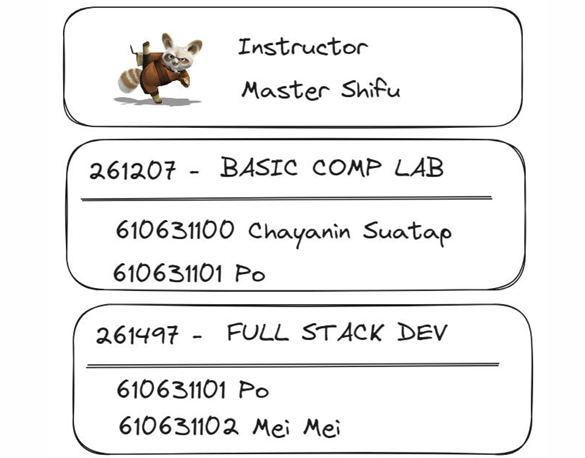
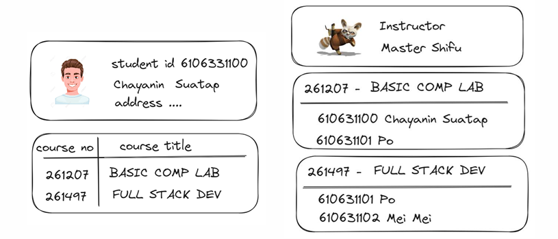

# Fullstack Development

---

# Database Design

---

# Content

- Database ranking
- SQL database
- NoSQL database
- Schema patterns
- Some useful information

---

# Database Engine Ranking

- Database engine
  - DBMS (Database Management System)
- [A brief history of databases](https://www.cockroachlabs.com/blog/history-of-databases-distributed-sql/)
- [DB-Engines Ranking](https://db-engines.com/en/ranking)

---

# SQL Database

- Relational database
- Organize data into `tables` of related information
- Utilize `Structured Query Language (SQL)` for managing/manipulating data

---

# SQL Database

---

# Popular RDBMS

- Open source: [MySQL](https://www.mysql.com/), [PostgreSQL](https://www.postgresql.org/)
- Commercial: [Oracle Database](https://www.oracle.com/database/), [Microsoft SQL Server](https://www.microsoft.com/en-us/sql-server), [IBM DB2](https://www.ibm.com/products/db2)
- [RDBMS Ranking](https://db-engines.com/en/ranking/relational+dbms)

---

# SQL

The standard language used to interact with SQL databases

- Data Definition Language (DDL)
  - e.g., `CREATE TABLE`, `ALTER TABLE`, `DROP TABLE`
- Data Manipulation Language (DML)
  - e.g., `INSERT`, `UPDATE`, `DELETE`, `SELECT`
- Data Control Language (DCL)
  - e.g., `GRANT`, `REVOKE`

---

# ACID Properties

- An acronym that stands for ...
  - `Atomicity`
  - `Consistency`
  - `Isolation`
  - `Durability`
- Ensure reliable transaction processing and data integrity
- [What does ACID Means?](https://medium.com/nerd-for-tech/understanding-acid-properties-in-database-management-98243bfe244c)

---

# NoSQL

- `non SQL` or `not only SQL`
- Store data in a format other than relational tables

---

# Types of NoSQL Database

- Document-oriented
- Column-oriented
- Graph-based
- Key-Value pair
- Time series

---

# Document Database

- The data is stored in `document`
- Each `document` is typically a `nested structure` of `keys` and `values`
- **Possible to retrieve only parts of a document**
- The most commonly used data format are `JSON`, `BSON`, and `XML`
- e.g., [MongoDB](https://www.mongodb.com/), [Apache CouchDB](https://couchdb.apache.org/)

---

# Document Database

---

## Document Database: Terminology

---

# Wide Column Data Store

- Store data in columns rather than rows
- Able to store large amounts of data in a single column
- Allows to reduce disk resources and the time to retrieve information
- Highly scalable and flexible
- e.g., [Apache Cassandra](https://cassandra.apache.org/_/index.html)

---

# Wide Column Data Store

---

# Graph Database

- Store and query highly connected data
- Data are modeled in the form of **entities** (`nodes`) and **relationships** (`edges`) between them
- Able to traverse from `nodes` or `edges` along defined relationship types until reaching some `defined condition`
  - Results : `lists`, `maps`, or graph `traversal path`
- e.g., [Neo4j](https://neo4j.com/)

---

# Graph Database

---

# Time Series Database

- Store and retrieve data records that are **sequenced by `time`**
  - Sets of data points associated with `timestamps` and stored in time sequence order
- Easy to measure how data change over time (e.g., IoT application)
- e.g., [InfluxDB](https://www.influxdata.com/), [Prometheus](https://prometheus.io/)

---

# Time Series Database

---

# Key-value Data Store

- Stores data as a collection of `key-value pairs`
- Each data item is identified by a `unique key`
- The `value` can be anything (string, number, object, ...)
- e.g., [Redis](https://redis.io/), [Memcached](https://memcached.org/)

---

# Key-value Data Store

---

# Database Schema

---

# What is Database Schema?

- DB Schema defines how data is organized within the databasae
- Outlining how data is logically stored
- **Key components**:
  - Tables, Columns, Data types, Constraints
  - Primary / Foreign keys
  - Relationships (`one-to-one`, `one-to-many`, `many-to-many`)

---

## Relationship : One-to-Many

e.g., **"Social media status post"**

- A `Post` may have many `comments`
- A `comment` belongs to only one `Post`

---

## SQL Schema : One-to-Many

---

## SQL Query : One-to-Many

e.g., **"Get a `Post` together with its `Comments`"**

SELECT \* FROM `Post` JOIN `Comment` ON `Post.Id` = `Comment.postId`;

---

## NoSQL Schema #1 : One-to-Many

**Option 1** - Embedding `Comments` as array in `Post` document

- Assuming that a `Post` has <u>less than a hundred</u> `Comments`

---

## NoSQL Schema #2 : One-to-Many

**Option 2** - Reference to other collections, avoiding massive array

- Reference each `Comment` to a single `Post`
- What if a `Post` may have thousands of `Comments`

---

# Summary : One-to-Many

#### SQL

- Create two tables with a `foreign key` (representing a relationship)

#### NoSQL

- Embedding an `array of objects` in `another type of object`
- References multiple `objects` to `another type of object`

---

## Relationship : Many-to-Many

e.g., **"Students Enrollment"**

- A `Student` may enroll in multiple `Courses`
- A `Course` is enrolled by many `Students`

---

## SQL Schema : Many-to-Many

---

## SQL Query : Many-to-Many

e.g., **"Get all `Courses` title enrolled by a `Student` with specified `studentId`"**

---

## SQL Query : Many-to-Many

e.g., **"Get all `Courses` title enrolled by a `Student` with specified `studentId`"**

---

## NoSQL Schema #1 : Many-to-Many

**Option 1** - Embedding a list of `Courses` in a `Student` document

---

## NoSQL Query #1 : Many-to-Many

e.g., **"Which `Students` enroll in my `Course`"**

---

## NoSQL Schema #2 : Many-to-Many

**Option 2** - Embedding a list of `Students` in a `Course` document

---

## What if we want both?

---

## NoSQL Schema #3 : Many-to-Many

**Option 3** - Embedding a list of `References` in both documents

- `Pros` : query efficiently from both sides
- `Cons` : duplicate data, need to update on both side

---

# Summary : Many-to-Many

#### SQL

- Create **three** tables with `foreign keys` and `JOIN` them together

#### NoSQL

- Choose which side of document to be embedded by <u>determining which side has more queries</u>
- Embedded on both sides and apply `data mutation` very carefully

---
