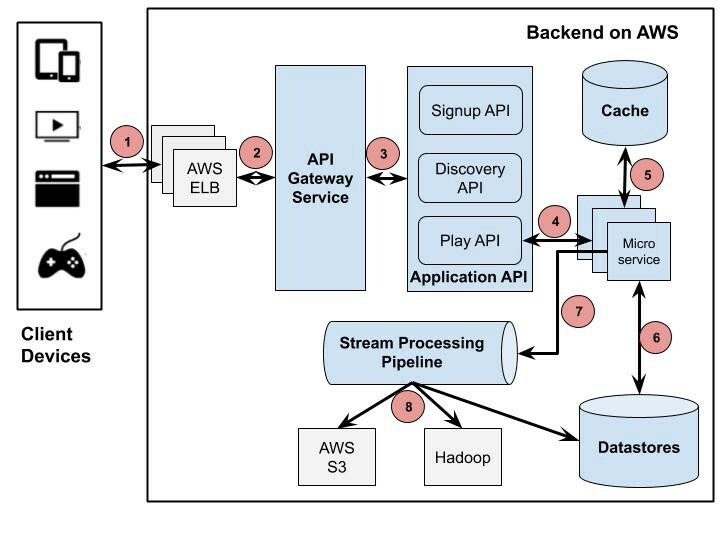
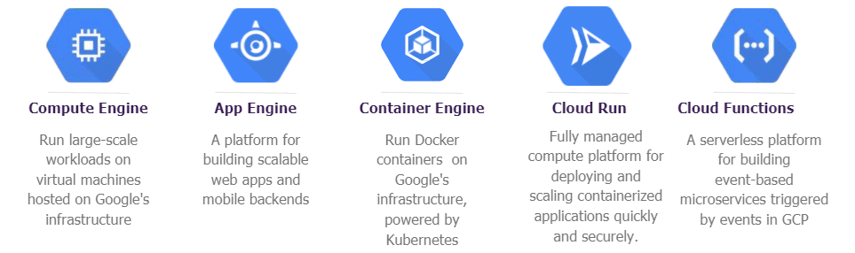
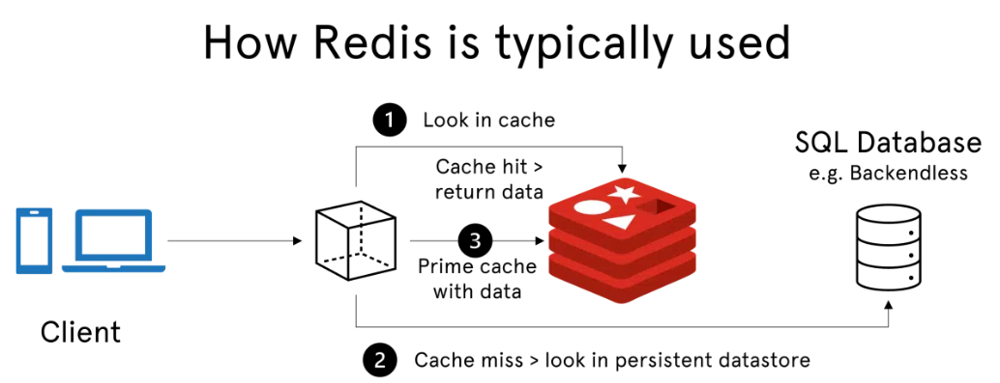
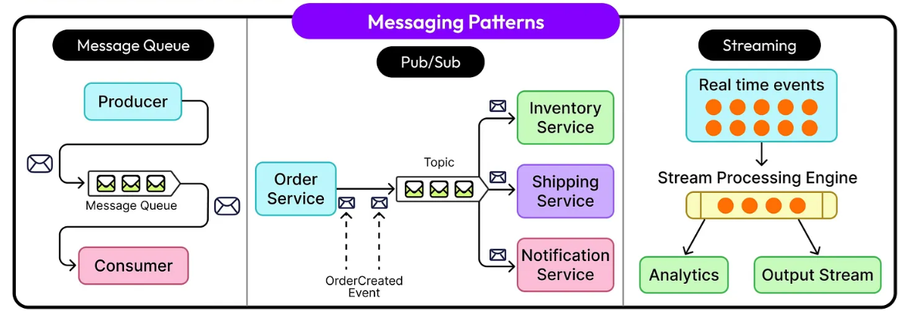
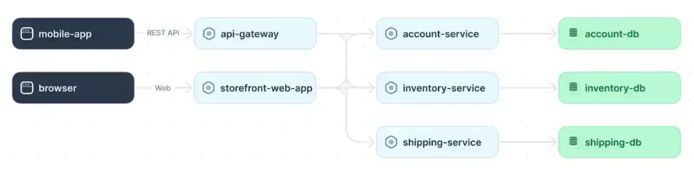

# Fullstack Development

---

# Backend Architecture

---

# Content

- What is backend architecture?
- Backend architecture components
- Backend practices

---

# What is backend architecture?

- The conceptual design and structure of server-side compoments
  - Business logic
  - Data layers
  - Security layers
  - 3rd-party integrations
- Involving deciding on and documentating a `blueprint` for the system

---

# Backend architecture components

- Servers
- Databases
- APIs
- Caching solutions
- Asynchronous messaging
- Authentication and authorization
- Other components

---

# Example: Netflix backend overview

---

# Servers

- Compute services
  - `Bare metal`, `Virtual machine`, `Container`, `Serverless`
- Provides resources, data, and services to clients
- Running server-side code
  - `business logic`, `process requests`, `manage data storage and retrieval`

---

# Databases

- Manages, retrieves, and stores data
  - `SQL databases` organizes data via tables with predefined schema
  - `NoSQL databases` provides more flexible schema
- Typically implemented via `DBMS`
  - MySQL, PostgreSQL, MongoDB, [Elasticsearch](https://www.elastic.co/elasticsearch), ...

see more detail in the `database design concepts`. <[HTML](../D01_database_design/D01.html) | [PDF](../D01_database_design/D01.pdf)>

---

# APIs

- **Application Programming Interfaces**
- Provides communication and data exchange between components
- Defines `rules`, `protocols`, `URIs`, `URLs` and `data formats` for request/response

---

# Caching Solutions

- Temporarily stores data in fast-access storage layer
- Improveing performance by reducing the need for `repeated queiries` or `API calls`
- Implementation options:
  - Web browser's localStorage, Application code (variables)
  - CDNs (`Cloudflare Cache`, `Amazon Cloudfront`)
  - In-memory caches ([`Redis`](https://redis.io/))

---

# Caching Solutions - Redis

---

# Asynchronous messaging

- Enables decoupled, `asynchronous communication` between sender and receiver
- `Messages` (requests/responses) are safely stored in a **broker**
- **No waiting for response** (better performance, scalability, and reliability)
- Typically used in `serverless` or `microservices architectures`
- Messaging pattern : `publish-subscribe`, `FIFO message queues`, `event streams`
- Message broker : [Redis](https://redis.io/), [Kafka](https://kafka.apache.org/), [RabbitMQ](https://www.rabbitmq.com/)

<a href="https://blog.bytebytego.com/p/how-to-choose-a-message-queue-kafka?utm_source=publication-search">How to choose a message queue?</a>

---

# Asynchronous messaging (2)

<a href="https://blog.bytebytego.com/p/messaging-patterns-explained-pub">ByteByteGo</a>

---

# Authentication and Authorization

- Ensure that only authenticated `client/user` can access the system
- Client/user has the `necessary permissions` to access resources or perform actions
- Authentication methods
  - `Password-based`, `MFA`, `OAuth`
- Authorization policies
  - `Role-based access control` (RBAC), `policy-based access control`, ...

---

# Other components

- **Object Storage service**
  - Amazon S3, Azure Blob Storage, Google Cloud Storage
  - [Minio](https://www.min.io/), [Garage](https://garagehq.deuxfleurs.fr/)
- **Network services**
  - Reverse Proxy: [Nginx](https://docs.nginx.com/nginx/admin-guide/web-server/reverse-proxy/), [Traefik](https://traefik.io/traefik)
  - Load balancers, Firewall/Security group
- **3rd-party integrations**
  - Payment service: [2C2P](https://2c2p.com/), [Omise](https://www.omise.co/en), [Stripe](https://stripe.com/en-th), Bank APIs
  - Streaming service

---

# Other components (2)

- Logging and monitoring
  - Application logs, Clickstream, Network logs
- CI/CD pipelines
  - [Jenkins](https://www.jenkins.io/)
  - [GitHub Action](https://github.com/features/actions), [GitLab CI/CD](https://docs.gitlab.com/topics/build_your_application/)
  - [Azure Pipelines](https://azure.microsoft.com/en-us/products/devops/pipelines), [AWS CodePipeline](https://aws.amazon.com/codepipeline/)
  - [Argo CD](https://argo-cd.readthedocs.io/en/stable/) (for Kubernetes)
- Infrastructure as code (IaC)
  - [Terraform](https://developer.hashicorp.com/terraform), [Ansible](https://docs.ansible.com/ansible/latest/getting_started/index.html)

---

# Backend practices

- The scope and nature of backend systems vary across different use cases
  - Types of applications, size, development team, time and budget
- Challenges
  - Ensuring scalability and reliability
  - Effective communication
  - Data managment

---

# Backend practices (2)

- A number of [distributed system design patterns](https://www.multiplayer.app/distributed-systems-architecture/distributed-systems-design/) have emerged to address common issues
- **Utilize a CI/CD pipeline**
  - Based on `reliable testing` and `test automation`
  - Keep `test scripts` up to date (update test script along with app code)
  - Regularly maintain `test suites` (keep test suites lightweight)
  - Choose a suitable `testing environment` (isolated and representative of prod environment)

---

# Backend practices (3)

- **Design for modularity**
  - A system should be composed of `loosely coupled modules` (better scalability)
  - Each module is its own independent unit with `minimal dependencies`
  - `Utilize an API gateway` (a single entry point for an app)
    - Receives all client requests
    - Routes them to the correct backend component or service
    - Allows updating and adding new components without affecting the client interface

---

# Example

An example of a system architecture diagram for a microserivces

---

# Reference

- [Backend Architecture: Tutorial & Best Practices](https://www.multiplayer.app/distributed-systems-architecture/backend-architecture/)
- [How to Choose a Message Queue?](https://blog.bytebytego.com/p/how-to-choose-a-message-queue-kafka?utm_source=publication-search)
- [Netflix System Design - Backend Architecture 2021](https://dev.to/gbengelebs/netflix-system-design-backend-architecture-10i3)
