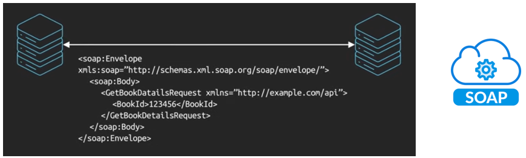

<style>
@import url('https://fonts.googleapis.com/css2?family=Prompt:ital,wght@0,100;0,300;0,400;0,700;1,100;1,300;1,400;1,700&display=swap');

    :root {
    font-family: Prompt;
    /* --hl-color: #D57E7E; */
}
h1 {
  font-family: Prompt
}
div {
  display: flex;
  justify-content: center;
}
</style>

# Fullstack Development

---

# API Architectures and Design #1

---

# Content

- **What is API?**
- **API Architecture Styles**
- RESTful API design
- API Security
- API Testing

---

# What is API?

### Application Programming Interfaces

- **Web service**
- Provides communication and integration between software systems
- Data exchange between components,
- Remote function calls

<div>

</div>

---

# API Architecture Styles

### Top 6 most popular styles:

<div>

</div>

---

# SOAP

- **Simple Object Access Protocol**
- XML-based for enterprise application, mature and comprehensive
- Commonly used in financial services

<div>

</div>

---

# RESTful

- **REpresentational State Transfer**
- Build on top of `HTTP methods`, popular and easy to implement
- Resource-based, rely on multiple endpoints, return fixed data structures
- Not suitable for `real-time` applications or highly connected model

<div>

</div>

---

# RESTful Example

<div>

</div>

---

# RESTful: E-Commerce

<div>

| Method | Endpoint          | Description              |
| ------ | ----------------- | ------------------------ |
| GET    | /products         | fetch a list of products |
| GET    | /users/{userId}   | fetch user details       |
| GET    | /orders/{orderId} | fetch order details      |
| ...    |                   |                          |

</div>

For `user order history`, multiple requests are required

---

# RESTful: Social Media Platform

<div>

| Method | Endpoint                  | Description               |
| ------ | ------------------------- | ------------------------- |
| GET    | /users/{userId}/posts     | fetch a user's posts      |
| GET    | /users/{userId}/followers | fetch a user's followers  |
| GET    | /posts/{postId}/comments  | fetch comments on a posts |
| ...    |                           |                           |

</div>

Each endpoint returns a fixed set of data, requiring multiple requests to gather all necessary information

---

# RESTful

### Use RESTful API when:

- API is simple and `CRUD-based`
- Want to use `HTTP caching`
- Building `public APIs` or microservices
- Prefer `minimal tooling` or need API to support older systems

---

# GraphQL

- `Architecture` and `query language`
- Allows clients to specify exact data they need (no `over-/under-fetching` data)
- Strong typed API (predefined `schema`)
- Operates through a single endpoint (flexible and efficient)
- **Hard** to optimized `database query` and `cache`

---

# GraphQL Example

<div>

</div>

---

# GraphQL: E-Commerce

```graphql
query GetUserOrders {
  user(id: "userId") {
    id
    name
    gender
    orders {
      id
      total
      items {
        product
        quantity
        price
      }
    }
  }
}
```

---

# GraphQL: Social Media

```graphql
query GetUserPosts {
  user(id: "userId") {
    id
    name
    posts {
      id
      content
      comments {
        id
        author {
          id
          name
        }
        content
      }
    }
  }
}
```

---

# GraphQL

### Use GraphQL when:

- Frontend needs custom or `nested data structure`
- Want to reduce the `number of API calls`
- Building and `SPA` or `mobile app` with dynamic UI
- Need `flexibility` and scalability

---

<!--_class: invert-->

# GraphQL vs. RESTful Comparison

<div>

</div>

---

# gRPC

- Open source **Remote Procedure Call** framework created by Google
- High performance for microservices
- Using `Protocol Buffer` (aka. `Protobuf`) which is **binary encoded**

<div>

</div>

---

# gRPC

### Why is gRPC very fast?

- Send data in binary encoded format (`Protobuf`)
- Run on HTTP/2 protocol

<div>


</div>

---

# gRPC

<div>

</div>

---

### gRPC - How does it work?

<div>

</div>

---

# WebSockets

- `Bi-directional` for `low-latency` data exchange over TCP connection
- `Real-time` and `persistent connection` (for Live chat, real-time gaming)

<div>

</div>

---

# WebSockets

### JavaScript/TypeScript library

[ws](https://www.npmjs.com/package/ws) - A simple WebSocket

```bash
npm install ws
npm install --save @types/ws
```

[Socket.IO](https://socket.io/)

```bash
npm install socket.io
npm install --save-dev typescript ts-node @types/socket.io
```

---

# Webhook

- `Asynchronous` for `even-driven` application
- `Webhook consumer` must register with `webhook provider`
  - When certain event occurs, `webhook provider` invokes `HTTP request` to `webhook consumer` at a `certain URL`
  - The `webhook consumer` then handles the request in certain way (e.g., notify user)

<div>


</div>

---

# Webhook

### [Stripe](https://stripe.com/en-th)

- Payment service
- Allow developer to register multipel webhooks, select specific `payment-related` events

### GitHub

- Able to notify developer about `code commits`, `pull requests`, and `issues`

### [Twilio](https://www.twilio.com/en-us)

- Communication service
- Able to notify developers about `SMS` and `voice-related` events

---

# References

- GraphQL Example: [Apollo Server](https://www.apollographql.com/docs/apollo-server/getting-started) | [Apollo Client](https://www.apollographql.com/docs/react/get-started)
- [REST vs. GraphQL: Choosing the right API for your project](https://blog.pixelfreestudio.com/rest-vs-graphql-choosing-the-right-api-for-your-project/)
- [GraphQL vs. REST: Top 4 advantages & disadvantages](https://research.aimultiple.com/graphql-vs-rest/)
- [How to integrate gRPC with React and TypeScript](https://blogs.deuexsolutions.com/how-to-integrate-grpc-with-react-and-typescript)
- [Using gRPC in React the Modern Way](https://dev.to/arichy/using-grpc-in-react-the-modern-way-from-grpc-web-to-connect-41lc)
- [Chat App driven by WebSockets using Socket.IO and TypeScript](https://medium.com/@edhalliwell/chat-app-driven-by-websockets-using-socket-io-and-typescript-ed49611d6077)
