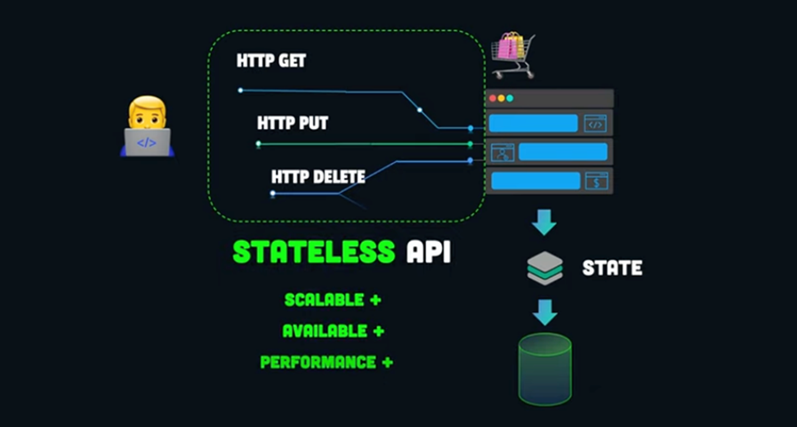
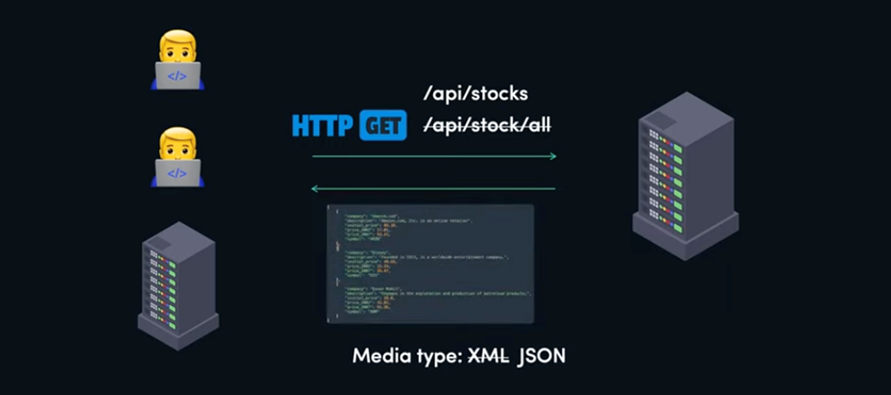

<style>
@import url('https://fonts.googleapis.com/css2?family=Prompt:ital,wght@0,100;0,300;0,400;0,700;1,100;1,300;1,400;1,700&display=swap');

:root {
font-family: Prompt;
--hl-color: #D57E7E;
}
h1 {
  font-family: Prompt
}
div {
  display: flex;
  justify-content: center;
}
</style>

<!--_class: normal-->

# Fullstack Development

---

<!--_class: normal-->

# API Design and Security

---

<!--_class: normal-->

# Content

- RESTful API Design
- API Security

---

# RESTful API Design

---

# RESTful API Design

#### Stateless

- **Single-server** environment
  - Server process any request without knowledge of previous requests
- **Multi-server** environment
  - Request not bound to a specific server
  - Able to provide service in `load-balanced` fashion
- Make APIs more `scalable` > more available
- Easy to `cache` (without state info)

---

# RESTful API Design (2)

#### Most applications require some froms of `state information`

<div>

</div>

---

# RESTful API Design (3)

<div>

</div>

---

# RESTful API Design (4)

<div>

</div>

---

# RESTful API Design (5)

<div>

</div>

---

# RESTful API Design (6)

#### Organize API around `resources` (not actions/verbs)

<div>

</div>

<br>

Using `HTTP method` to differentiate `actions`

---

# RESTful API Design (7)

#### `Endpoint` consistency is key, using `plural form` in URLs is recommended

<div>

</div>

---

# RESTful API Design (8)

#### `HTTP Methods` and `CRUD` operations

<div>

</div>

---

# RESTful API Design (9)

#### How to do complex query?

<div>

</div>

---

# RESTful API Design (10)

#### `Entities` are grouped into `collections`

<div>

</div>

---

# RESTful API Design (11)

#### Use `parameterized URIs` for identity

<div>

</div>

---

# RESTful API Design (12)

#### Avoid deeply nested URLs (`/collection/item/collection`)

<div>

</div>

<div>

`GET  /customers/1?order=99`

</div>

# RESTful API Design (13)

#### Use `query params` for additional `options` or metadata

<div>

</div>

---

# RESTful API Design (14)

#### Do not return `plain-text` response

- Client has to do some extra parsing/processing

<div>

</div>

---

# RESTful API Design (15)

#### Response with `JSON` / `XML` / `YAML`

<div>

</div>

---

# RESTful API Design (16)

#### Allow client to specify `Content-Type` header

<div>

</div>

---

# RESTful API Design (17)

#### `Changing API` after it has been adopted is dangerous!

<div>

</div>

---

# RESTful API Design (18)

#### Clients need to `update code/documents` to make app work again

<div>

</div>

---

# RESTful API Design (19)

#### However, `business requirements` are always `changed`

<div>

</div>

---

# RESTful API Design (20)

#### `API versioning` is the answer

<div>

</div>

---

# RESTful API Design (21)

#### `API versioning` comparison

<div>

</div>

---

# RESTful API Design (22)

#### API `exception handling` and response with proper `HTTP status code`

<div>

</div>

---

# RESTful API Design (23)

#### `HTTP status code`

<div>

</div>

---

# RESTful API Design (24)

#### Including `links` in `JSON responses` is a common practice

```json
{
  "id": 1,
  "name": "Example",
  "links": {
    "self": "http://api.example.com/resource/1",
    "related": "http://api.example.com/resource/2"
  }
}
```

---

# RESTful API Design (25)

#### Content return policies

Return the created resource

- HTTP status code: `201 Created`, `Location` header of resource's URI
- Full detail of the `newly created resource`

```json
HTTP/1.1 201 Created
Location: /resources/123
Content-Type: application/json
{
  "id": 123,
  "name": "New Resource"
}
```

---

# RESTful API Design (26)

#### Content return policies

**Do not return content**

- Only a `201 Created` or `204 No Content` response, and `Location` header
- Minimizes data transfer

```json
HTTP/1.1 201 Created
Location: /resources/123
```

---

# References

- [Best practices for REST API design](https://stackoverflow.blog/2020/03/02/best-practices-for-rest-api-design/)
- [Mastering RESTful API Design: A Practical Guide](https://dev.to/leapcell/mastering-restful-api-design-a-practical-guide-408)
- [REST API - Best Practices - Design](https://youtu.be/1Wl-rtew1_E?si=bGiBg-abaBpLKZYJ)
