

<!--_class: normal-->

# Fullstack Development

---

<!--_class: normal-->

# API Architectures and Design #3

---

<!--_class: normal-->

# Content

- What is API?
- API Architecture Styles
- RESTful API design
- **API Security**
- API Testing

---

# API Security

---

# 12 Tips for API Security

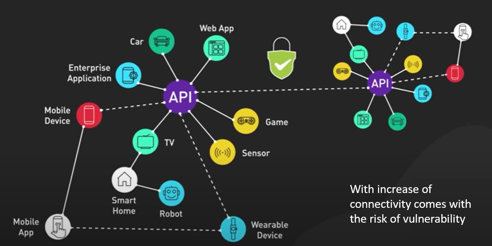

---

# 12 Tips for API Security

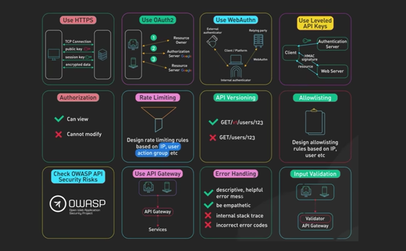

---

# 1. Use HTTPS

- `Encrypt data` transmitted between client and server
- Prevent `eavesdropping` and `man-in-the-middle-attack`
- Protect `API keys`, `session tokens`, and user data

 

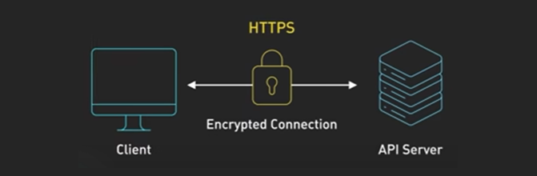

---

# 2. Use OAuth2

- Modern industry standard `authorization` protocol
- Allow a user to grant `3rd-party` app (i.e., our application) limited access to its resources
  - Without sharing user's credential
  - `Authorization server` generates and return a `temporary token` to client 
  - `Client` uses the token to access 3rd-party app resources

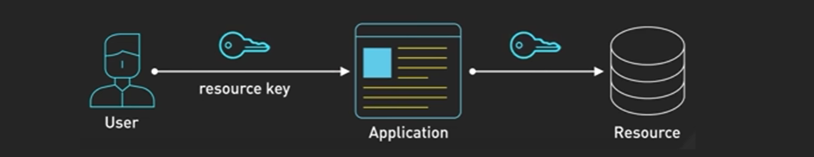

---
<!--_class: normal-->
Google OAuth2

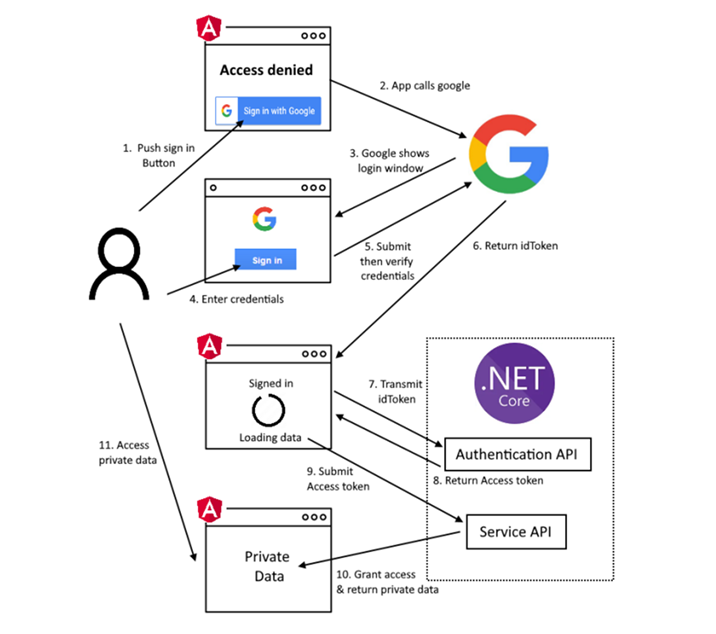

---

# 3. Use WebAuthn (and Passkey)

- `WebAuthn` is technical standard for `passwordless` authentication 
  - Using `public-key` cryptography
- `Passkey` is a user-friendly implementation of WebAuthn
  - User needs to register `Passkey` for each device (laptop, mobile, ...)
  - For each `Passkey`, a pair of `public-private` key is generated

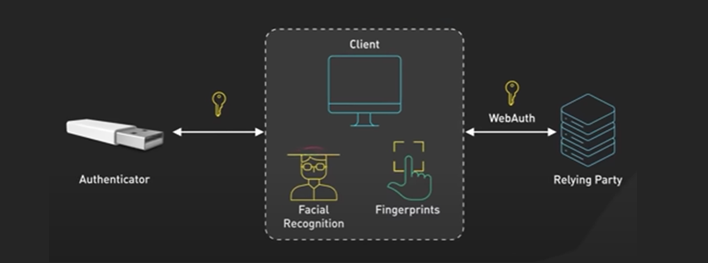

---
<!--_class: normal-->
Signing in with `Passkey`

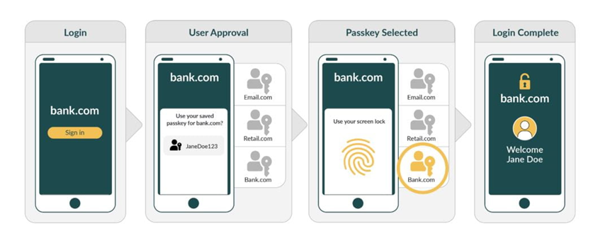

---

# 4. Use Leveled API Keys

- Use **Multiple API keys** for different `permissions`/`resources`
  - `Read-only` access: retrieve data
  - `Write` access: modify data
  - `Admin` access: deploy update, ...
- If a key is **compromised**, attacker only have a certain access
  - Minimize **blast radius**

---

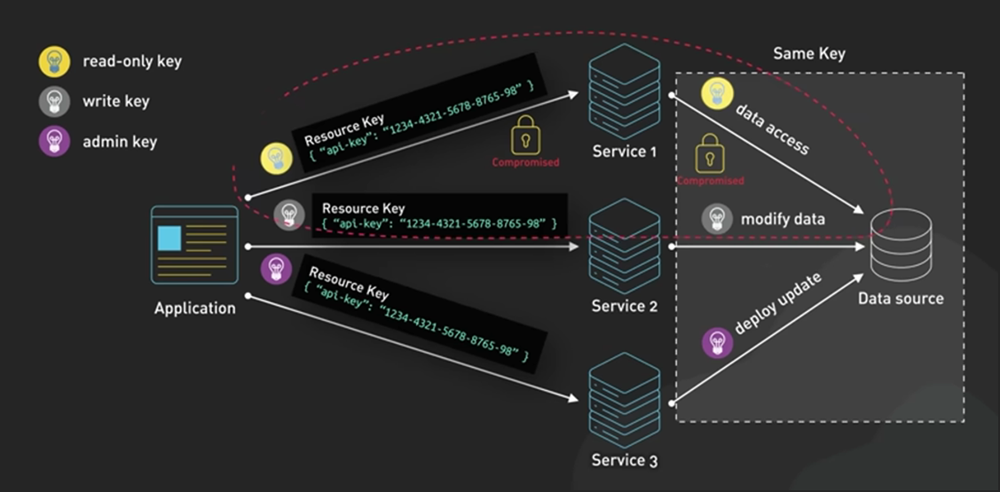

---

# 5. RBAC Authorization

- Implement **Role-based Access Control**
- Different `roles` have different group of `permissions`
- A **user** may be assigned with **multiple roles**

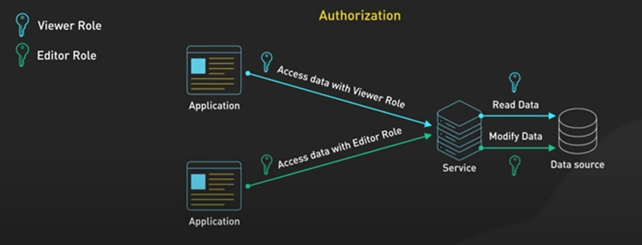

  
---

# 6. Rate limiting

- Controls the **number of requests** in a given period of time (`#hour`, `#days`)
- Improves `security`, `performance`, and `availability`
- Can be based on many factors: `IP Address`, `User ID`, `API Key`, ...

 

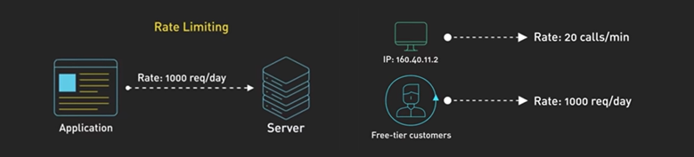

---

# 7. API Versioning

- Allow developer to evolve API over time
- Provide new features without disrupting existing clients
- Help in **change management** and **documentation**

 

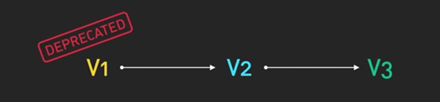

---

# 8. Allow Listing

- A list of explicitly **allowed entities** (aka. `Whitelist` )
  - `IP Address`, `User ID`, `API Key`, ...
  - **Deny all**, **Permit some**
- Give limited access to certain resources

---
Whitelist

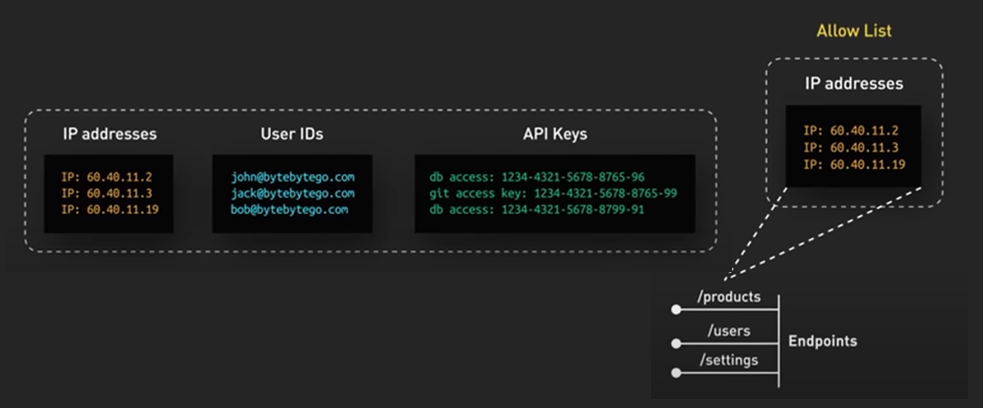

---

# References

- [Best practices for REST API design](https://stackoverflow.blog/2020/03/02/best-practices-for-rest-api-design/)
- [Mastering RESTful API Design: A Practical Guide](https://dev.to/leapcell/mastering-restful-api-design-a-practical-guide-408)
- [REST API - Best Practices - Design](https://youtu.be/1Wl-rtew1_E?si=bGiBg-abaBpLKZYJ)
