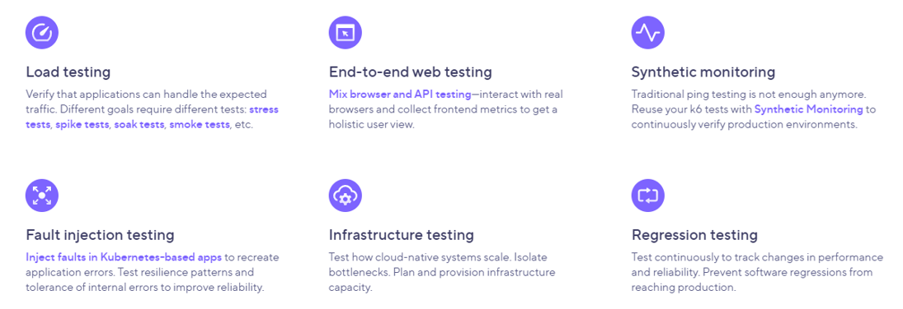
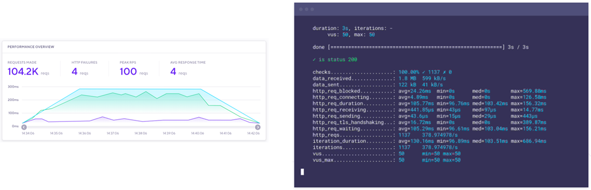
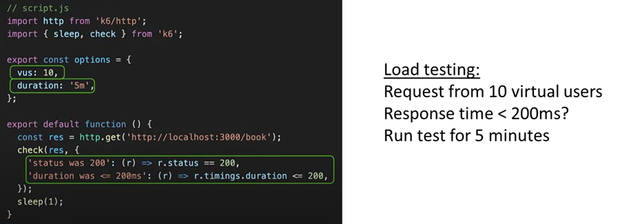
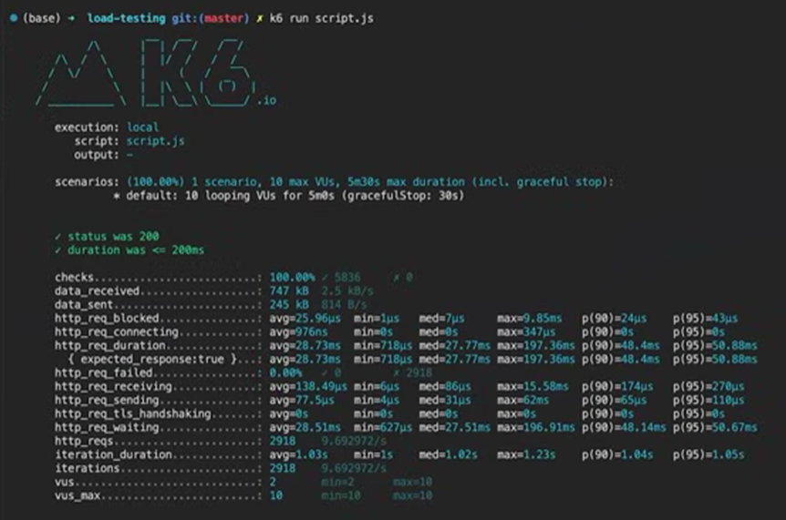
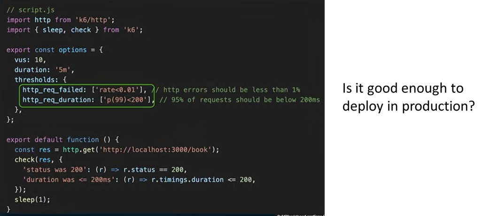
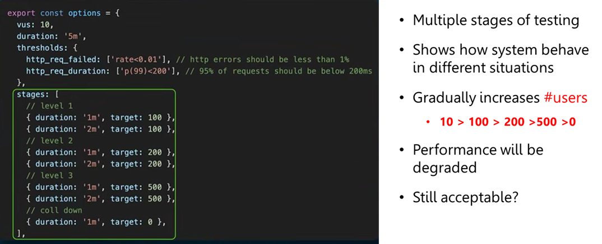
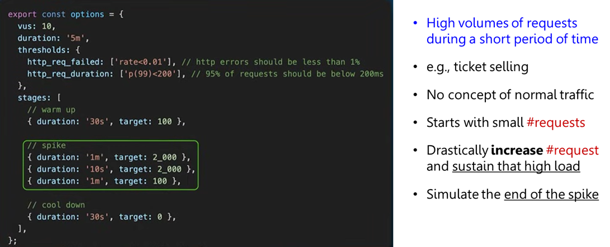
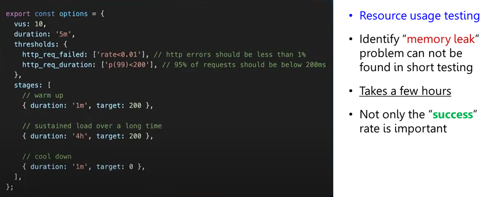

<!--_class: normal-->

# Fullstack Development

---

<!--_class: normal-->

# API Architectures and Design #4

---

<!--_class: normal-->

# Content

- What is API?
- API Architecture Styles
- RESTful API design
- API Security
- **API Testing**

---

# API Testing

**Functionality** <[Cypress](https://www.cypress.io/), [Postman](https://www.postman.com/), [Insomnia](https://insomnia.rest/)>

- Endpoints return the `correct data` and perform the `expected operations`

**Reliability**

- Ability to handle various scenarios (error conditions) `without crashing`

**Security** <[OWASP Tools](https://owasp.org/www-project-api-security-testing-framework/), [Google Apigee]()>

- Identifying **vulnerabilities**
- `Unauthorized access`, `data breaches`, `injection flaw`

**Performance** <[Apache JMeter](), K6>

- Measuring `response time` and `throughtput` under different **load conditions**

---

# API Performance Testing

---

# Performance Testing Tool

### [K6](https://k6.io/)

- An open-source **load testing tool** developed by **Grafana Labs**
- Write tests in `JavaScript` or `TypeScript`
  - Run locally (`Windows`, `macOS`, `Linux`, `Docker`)
  - Run on **Grafana Cloud**
- Supports `RESTful`, `GraphQL`, `WebSocket`, `gRPC`
- Supports different types of testing

---

# Types of Testing

---

# K6 Results

---

# What does performance mean?

- Influences the **type of tests** you should perform
- Define normal API traffic and **acceptable response time**

---

<!--_class: invert-->

---

# Specify Thresholds

---

# Stress Testing

---

# Spike Testing

---

# Soak Testing

---

# References

- [API Testing: A Guide for Beginners and Expert](https://konghq.com/blog/engineering/api-testing-understanding-the-basics)
- [Is Your API actually ready for user traffic?](https://youtu.be/9JPbnYUeKuM?si=HTIaZPy38g5a7gno)
- [Git - Template to use TypeScript with k6](https://github.com/grafana/k6-template-typescript)
- [Getting Started with Performance Testing in Typescript Using K6](https://medium.com/@sebastian.southern/performance-testing-in-typescript-with-k6-a65377f547e6)
