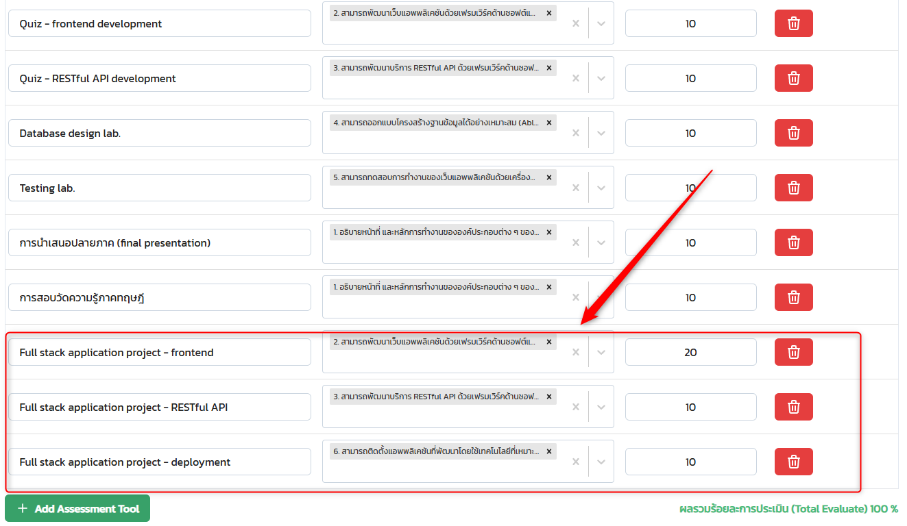

# Fullstack Development

---

# Self Evaluation

### Roadmap

https://roadmap.sh/full-stack

### Form

https://forms.office.com/r/ZGzaZM9yxm

---

# Preflight Project

---

# Objective

> Develope "end-user-ready" full-Stack application in 2 weeks.

- [Ideas](https://github.com/ZOUHAIRFGRA/100-Project-Ideas-for-Full-Stack-Developers)

---

# Why?

- Give students experience of the overview of the full-stack technology.
  - Before going into "real" project.
- Want smaller groups ➡️ better learning experience.
- Give students more chance to iterate ➡️ better coding decision in the `project`.

---

# Requirement

- Full stack technology
  - Anything that you can run on local development environment.
  - No cloud service (e.g. Firebase)
  - If using JavaScript frameworks, use TypeScript.
- Automated Testing
  - API testing
  - UI testing

---

# Requirement (cont)

- Deployment
  - Deploy on CPS virtual machine (Ubuntu).
  - No Netlify, Vercel, Railway
- Source code repository
  - GitHub
  - GitLab
- CI/CD
  - Github action
  - ...

---

# Sounds Impossible?

> Acually, it is not that hard. Check out [last year's projects](https://youtube.com/playlist?list=PLNGLpHQhvGrsBYoetbinh5A02H59bneg6&si=YrUCcnxJpP5RqHMo).
> _(Check `G2`, `G9`, `G11`)_

---

# Due date

> Sunday 27 July 2015

---

## Deliverables

- URL to your deployed application
- URL to your source-code repositories
- URL to your VDO
  - File-downloadable (ผมขอเก็บไฟล์)
  - ความยาวไม่เกิน 5 นาที (Please)

---

# VDO Checklists (1)

- Introduction
  - แนะนำสมาชิกในกลุ่ม
  - ทำแอปอะไร สาธิตการทำงาน (Show me your CRUD!)
  - สรุป Technology Stack

---

# VDO Checklists (2)

- Database
  - ใช้ Database อะไร
  - มีโครงสร้างข้อมูลเป็นอย่างไร (e.g. แสดงหน้าใน Dbeaver)
  - ใช้ ORM อะไร
  - มีอะไรที่อยาก Show เทพ (แตกต่างจากที่สอน)

---

# VDO Checklists (3)

- Backend
  - ใช้ Framework อะไร
  - มี Endpoint อะไรบ้าง (สามารถอธิบายจาก Code หรือเขียน Diagram)
  - มีอะไรที่อยาก Show เทพ (แตกต่างจากที่สอน)
- Frontend
  - ใช้ Framework อะไร
  - อธิบาย Structure ของ Code คร่าวๆ
  - มีอะไรที่อยาก Show เทพ (แตกต่างจากที่สอน)

---

# VDO Checklists (4)

- Testing
  - ใช้ Framework อะไร
  - มี การ Test API อะไรบ้าง
  - มี การ Test UI อะไรบ้าง
  - มีอะไรที่อยาก Show เทพ (แตกต่างจากที่สอน)

---

# VDO Checklists (5)

- Deployment
  - ใช้ Technology อะไร (e.g. Docker)
  - อธิบาย Step ของการ Deployment
    - แสดง `Dockerfile`, `docker-compose.yml`
    - อธิบายการสร้าง Image/Container, etc.
  - มีอะไรที่อยาก Show เทพ (แตกต่างจากที่สอน)

---

# VDO Checklists (6)

- CI/CD
  - Show ว่าพอ Commit ใน Repository แล้วแอปอัพเดตได้

---

# Grade

- 10%
- Score distribution (see image)
  

---

# Extra credit

- Nice-looking UI design
- More complex data relationship (e.g. join tables)
- Includes Authentication / Authorization
- Use different stacks than the class example.

---

# Timeline (1)

|  Date  | Day |             Topics             |
| :----: | :-: | :----------------------------: |
| 24 Jun | Tue | Modern Javascript / Typescript |
| 27 Jun | Fri |           TypeScript           |
| 01 Jul | Tue |            Database            |
| 04 Jul | Fri |            Backend             |
| 08 Jul | Tue |            Frontend            |

---

# Timeline (2)

|  Date  | Day |   Topics   |
| :----: | :-: | :--------: |
| 11 Jul | Fri | _no class_ |
| 15 Jul | Tue |  Testing   |
| 18 Jul | Fri | Deployment |
| 22 Jul | Tue |  Workshop  |
| 27 Jul | Sun |  Due date  |

---

# Group assignment

> Go to Mango Canvas

---

# Tools

- VSCode
  - Prettier
  - ESLint, ES7
  - Quokka.js
- Docker Desktop
- Node.js
- Git

---

# Tools

- Database client
  - Dbeaver
- API Testing tool
  - Insomnia
  - Postman
  - Thunder client (VSCode extension)

---

# AI Assistant

> Disclaimer: Nirand's take

- Try to avoid AI autocomplete tools (GitHub Copilot Extension, Cursor) during the learning phase.
  - Save some 💵💵💵.
- Use AI as a learning assiantant.
  - Ask AI to explain code.
  - Ask AI question about the code.
  - Ask AI to improve code.
- Do not copy/paste without understanding the code.
