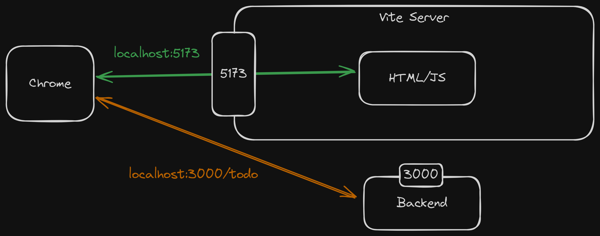
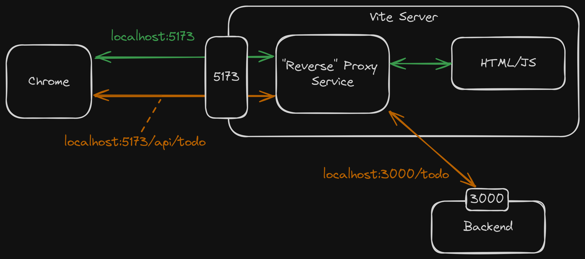
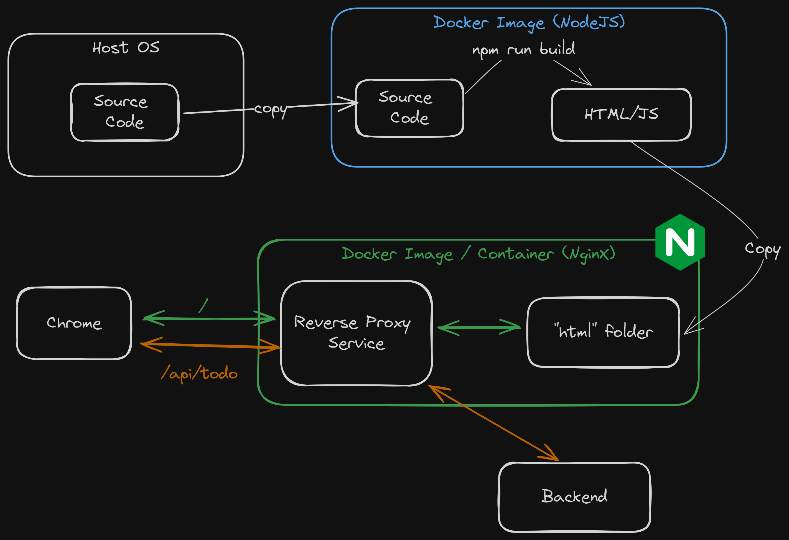
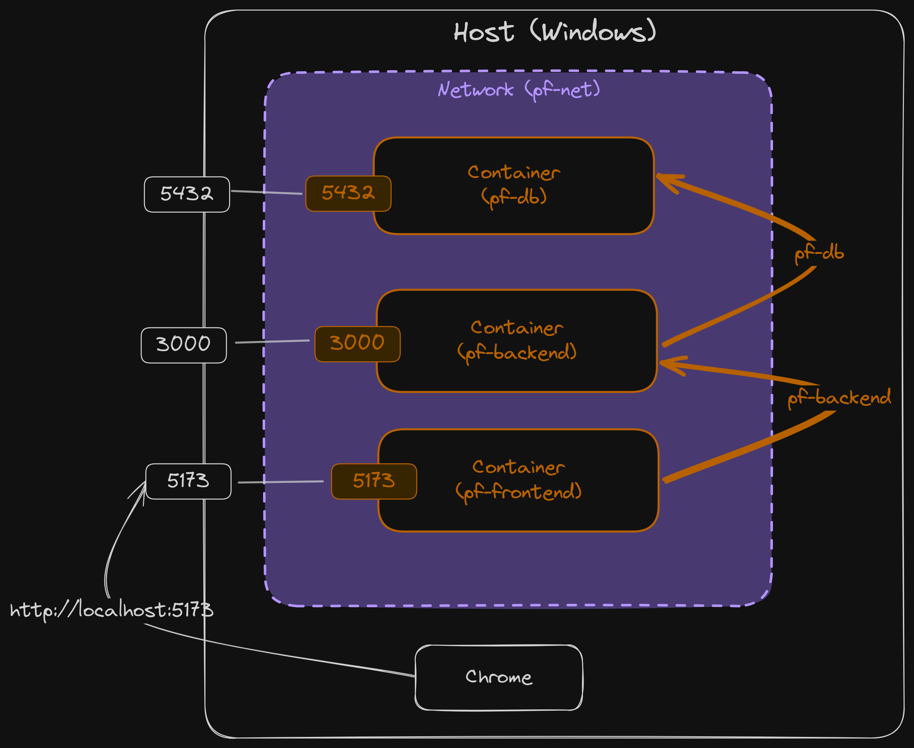

# Fullstack Development

---

# Preflight project - frontend

[Github Repo](https://github.com/fullstack-68/pf-frontend)

---

# Frontend framework

> Tool that enables you to develop the frontend of your applications

### Why?

- You don’t have to everything code from scratch.
- You can collaborate with others more easily.

---

# Frontend JS framework

- [State of JS 2024](https://2024.stateofjs.com/en-US/libraries/front-end-frameworks/)
- [Stack Overflow Survey 2024](https://survey.stackoverflow.co/2024/technology#1-web-frameworks-and-technologies)

---

# Frontend tooling

- Code bundler (_"build tools"_)
- Development server
  - Hot module replacement (HMR)

---

# Frontend tooling

- [Vite](https://2024.stateofjs.com/en-US/libraries/#tier_list)
- Webpack
- Parcel
- Rollup

---

# Setup

- React
  - `pnpm create vite@latest` (_Follow the instruction_)
- Additional libraries
  - `pnpm i dayjs axios @picocss/pico`

---

# Files

- Remove all `css` files
- `./vite.config.ts` [(Link)](https://github.com/fullstack-68/pf-frontend/blob/main/vite.config.ts)
- Modify `./tsconfig.node.json` [(Link)](https://github.com/fullstack-68/pf-frontend/blob/77961c24c063066c2437f81892b72090964899d7/tsconfig.node.json#L5)
- Modify `./package.json` [(Link)](https://github.com/fullstack-68/pf-frontend/blob/77961c24c063066c2437f81892b72090964899d7/package.json#L7)
- `./src/main.ts` [(Link)](https://github.com/fullstack-68/pf-frontend/blob/main/src/main.tsx)
- `./src/types.ts` [(Link)](https://github.com/fullstack-68/pf-frontend/blob/main/src/types.ts)
  - I use [Quicktype](https://app.quicktype.io/) to generate this.

---

# Minimal example

- `./src/App.ts` [(Link)](https://github.com/fullstack-68/pf-frontend/blob/main/src/App.min.tsx)
- Start dev
  - `npm run dev`

---

# Full example

- `./src/App.ts` [(Link)](https://github.com/fullstack-68/pf-frontend/blob/main/src/App.tsx)
- Build
  - `npm run build`
- Preview
  - `npm run preview`

---

# Why reverse proxy?

- No need to expose your backend to the internet.
- No issues with CORS and cookies.

---

# Without reverse proxy

---

# Wtih reverse proxy

---

# Containerization

---

---

# Steps

- 💾 Make `./.env.test` from `./.env.test.example` [(Link)](https://github.com/fullstack-68/pf-frontend/blob/main/.env.test.example)
- 💾 `./Dockerfile` [(Link)](https://github.com/fullstack-68/pf-frontend/blob/main/Dockerfile)
- 💾 `./.dockerignore` [(Link)](https://github.com/fullstack-68/pf-frontend/blob/main/.dockerignore)
- 💾 `./nginx.conf.template` [(Link)](https://github.com/fullstack-68/pf-frontend/blob/main/nginx.conf.template) [(Why)](https://serverfault.com/a/919212)
- 💾 `./docker-compose.yml` [(Link)](https://github.com/fullstack-68/pf-frontend/blob/main/docker-compose.yml)
- ⌨️ `docker compose --env-file ./.env.test up -d --force-recreate --build`

---

---

# Push to Dockerhub

- Create an account at https://hub.docker.com.
- Create repository called `preflight-frontend`.
- Tag image
  - ⌨️ `docker tag preflight-frontend [DOCKERHUB_ACCOUNT]/preflight-frontend:latest`
- Login (if you have not done so)
  - ⌨️ `docker login -u [DOCKERHUB_ACCOUNT]`
- Push image
  - ⌨️ `docker push [DOCKERHUB_ACCOUNT]/preflight-frontend:latest`
