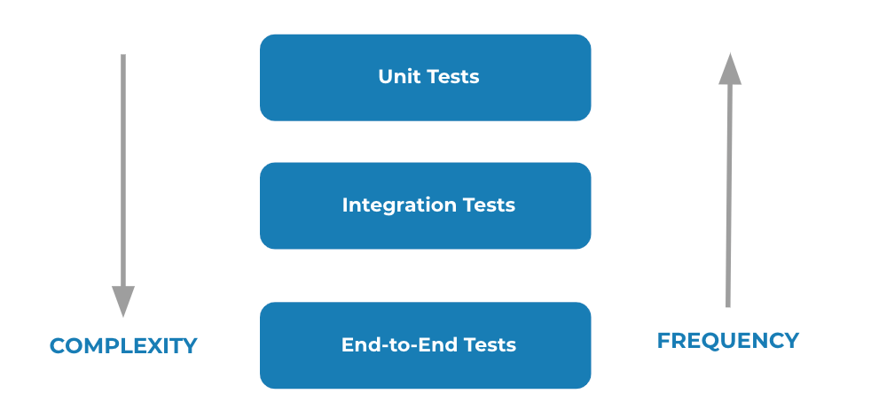

# Fullstack Development

---

# Preflight project - automated testing

[Github Repo](https://github.com/fullstack-68/pf-testing)

---

# Setup (Repos)

- [DB](https://github.com/fullstack-68/pf-db)
- [Backend](https://github.com/fullstack-68/pf-backend)
- [Frontend](https://github.com/fullstack-68/pf-frontend)

---

# Testing types

---

# Testing types

- Unit test
  - Tests individual code components.
- Interation test
  - Checks code dependency.
- End-to-end test
  - Assesses an application's functionality and user experience.

---

# Testing frameworks

- [State of JS 2024](https://2024.stateofjs.com/en-US/libraries/testing/)

---

# Setting up

- `npm init es6`
- `pnpm install cypress typescript dotenv @tsconfig/node-lts @tsconfig/node-ts @types/node`
- `npx cypress install`
  - This will install `Cypress` binary into `$env:LOCALAPPDATA/Cypress` (Windows).

---

# Files

- `./tsconfig.json` [(Link)](https://github.com/fullstack-68/pf-testing/blob/main/tsconfig.json)
  - _Note this [issue](https://github.com/fullstack-68/pf-testing?tab=readme-ov-file#issue)_
- `./.env` from `.env.example` [(Link)](https://github.com/fullstack-68/pf-testing/blob/main/.env.example)
- `./.gitignore` [(Link)](https://github.com/fullstack-68/pf-testing/blob/main/.gitignore)
- Modify `./package.json` [(Link)](https://github.com/fullstack-68/pf-testing/blob/d03dc0b10a764f4bd90bd70d9a9051005783222b/package.json#L27)

---

# Run your first test

- `npm run test`

---

# Cypress Browser

- Click `E2E Testing` ➡️ `Continue` ➡️ `Start E2E Testing in Chrome`
- Click `Create New Spec` ➡️ Name your spec (`min.cy.ts`) ➡️ Run spec

---

# Minimal example

- `./cypress/e2e/min.cy.ts` [(Link)](https://github.com/fullstack-68/pf-testing/blob/main/cypress/e2e/min.cy.ts)

---

# Full example

- Enable reading `.env`
  - `./cypress.config.ts` [(Link)](https://github.com/fullstack-68/pf-testing/blob/main/cypress.config.ts)
- Spec files
  - `./cypress/e2e/backend.cy.ts` [(Link)](https://github.com/fullstack-68/pf-testing/blob/main/cypress/e2e/backend.cy.ts)
  - `./cypress/e2e/frontend.cy.ts` [(Link)](https://github.com/fullstack-68/pf-testing/blob/main/cypress/e2e/frontend.cy.ts)
