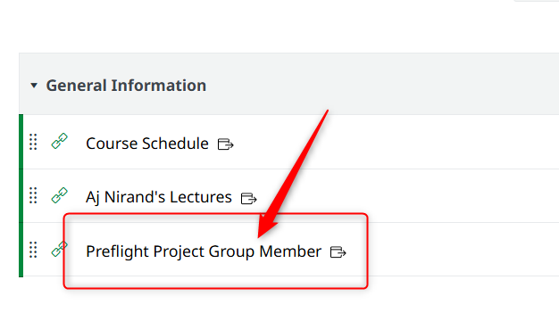
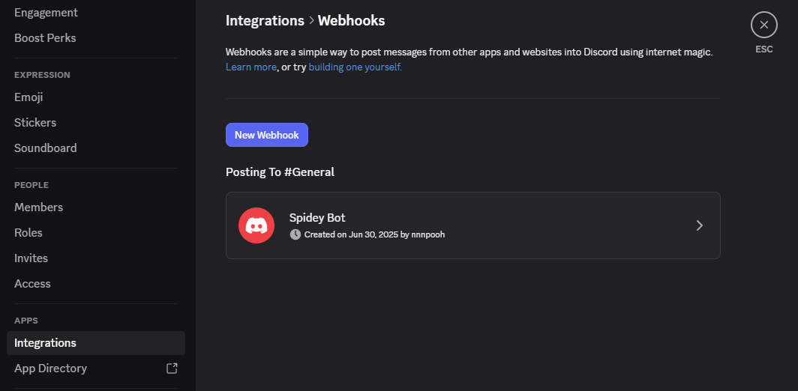
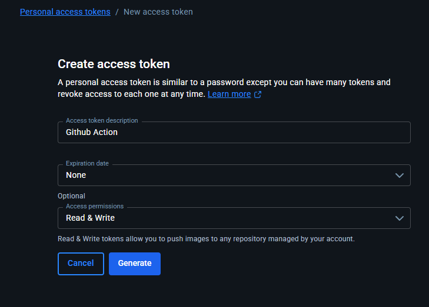
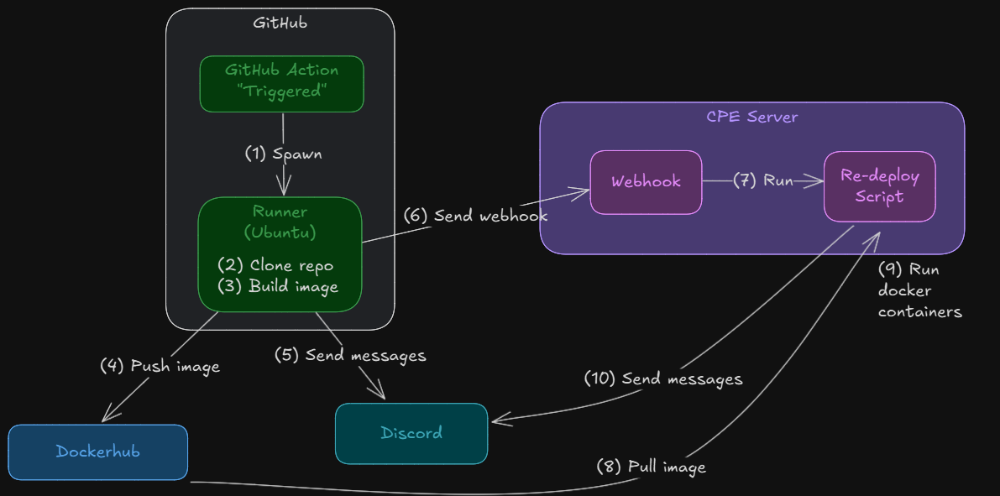

<style>
@import url('https://fonts.googleapis.com/css2?family=Prompt:ital,wght@0,100;0,300;0,400;0,700;1,100;1,300;1,400;1,700&display=swap');

    :root {
    font-family: Prompt;
    --hl-color: #D57E7E;
}
h1 {
  font-family: Prompt
}
</style>

# Fullstack Development

---

# Preflight project - deployment

[Github Repo](https://github.com/fullstack-68/pf-deploy)

---

# Local machine

---

# Clear your dev environment

- Remove all containers
- Remove volumes
  - `docker volume prune -a`
- Remove all image cache
  - `docker image prune -a`

---

# Setup

- `git clone https://github.com/fullstack-68/pf-deploy.git`
  - _Better yet, fork and clone this repo_
- `cd pf-deploy`
- Make `.env` from `.env.example` (Make necessary changes.)
- Take care of `./_entrypoint/init.sh`
  - Windows: Make sure that you save with LF option.
  - Mac/Linux: `chmod +x ./\_entrypoint/init.sh`
- `docker compose up -d --force-recreate`

---

# Remote server

---

# Setup

- `ssh USERNAME@10.10.x.x`
- Repeat steps we just did on local machine
  - Use the assigned `FRONTEND_PORT` or else the public url will not work.
- Check log by `docker compose logs`



---

# CI/CD

---

# CI/CD

- Stands for _Continuous Integration and Continuous Delivery/Deployment_.
- Practice that aims to automate and streamline the process of `building`, `testing`, and `deploying` code.
- We will explore the automated _building and deploying_ in this class.

---

# Setup

```
# Repository Variable
PROJECT_GROUP=gxx
IMAGE_NAME=DOCKERHUB_ACCOUNT/preflight-frontend

# Repository Secret
WEBHOOK_SECRET=
DISCORD_WEBHOOK=
DOCKERHUB_USERNAME=
DOCKERHUB_TOKEN=
```

---

# Discord Webhook



---

# Dockerhub Token



---

# Test `cpe_sever` Webhook

Send `POST` request

- https://fs-webhook.iecmu.com/hooks/test
- Body

```
{
  "data": {
    "project_group": PROJECT_GROUP,
    "discord_webhook": DISCORD_WEBHOOK",
    "webhook_secret": WEBHOOK_SECRET
  }
}
```

---

# Test GibHub Action

- Create secret and variables.
- Create test [workflow](https://github.com/fullstack-68/pf-frontend/blob/main/.github/workflows/test_webhook.yml).
- Run test workflow.

---

# Actual CI/CD

- Use this [workflow](https://github.com/fullstack-68/pf-frontend/blob/main/.github/workflows/redeploy.yml)

---



---

# Behind the Server

- [`Webhook` config](https://github.com/fullstack-68/pf-cicd/blob/main/webhook/hooks.json)
- [`redpeloy` script](https://github.com/fullstack-68/pf-cicd/blob/main/webhook/redeploy.sh)

---

# Recap

| Topic      | Stack                    |
| ---------- | ------------------------ |
| Language   | TypeScript               |
| DB         | PostgreSQL / Drizzle ORM |
| Backend    | Express                  |
| Frontend   | Reac / Vite              |
| Testing    | Cypress                  |
| Deployment | Docker / Nginx           |
| CI/CD      | GiHub Action             |

---

# Congratuations!

> Now go and make awesome apps!
