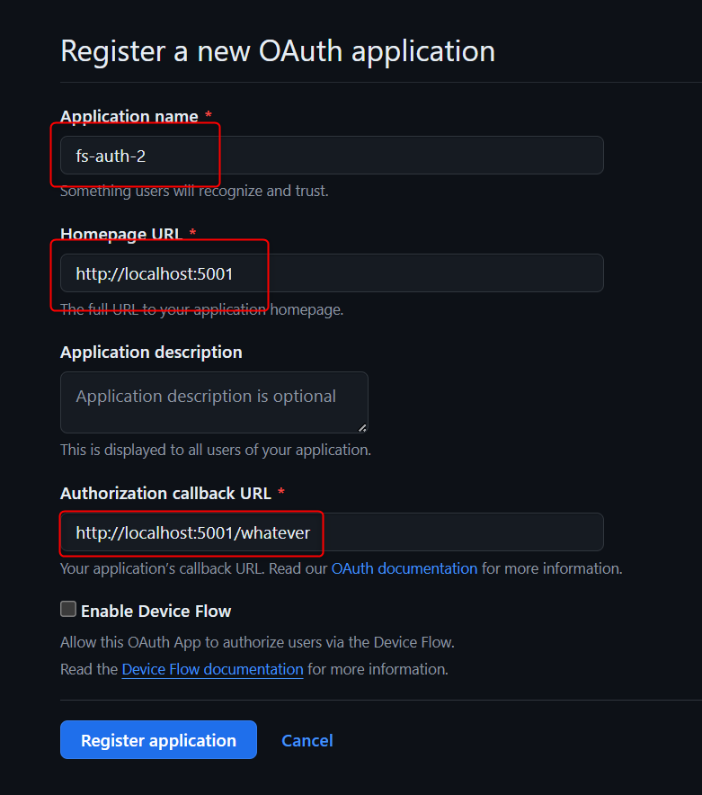

<style>
@import url('https://fonts.googleapis.com/css2?family=Prompt:ital,wght@0,100;0,300;0,400;0,700;1,100;1,300;1,400;1,700&display=swap');

    :root {
    font-family: Prompt;
    --hl-color: #D57E7E;
}
h1 {
  font-family: Prompt
}
</style>

# Fullstack Development

---

# Authentication / Authorization

---

# Part 2: Social signing up/in

---

# Something like this

_We need OAuth 2.0._


---

> Part 2: Social signing up/in

# Section 2A: OAuth 2.0

---

# OAuth 2.0

_Example of consent screen_


---

# OAuth 2.0

- "Open Authorization"
- Standard designed to allow application to access resources hosted by other web apps on behalf of a user.

  - Standard for `author`
  - Not for [`authen`](https://www.scottbrady91.com/oauth/oauth-is-not-authentication)

- Replaced OAuth 1.0 in 2012.

---

# OAuth 2.0

- Specifies many "flows"
  - **Authorization Code Flow**
  - Client Credentials Flow
  - Refresh Token Flow
  - JWT Bearer Flow
  - Device Code Flow
- We will use "Authorization Code Flow" for social login.

---

# Recommended resources

- https://engineering.backmarket.com/oauth2-explained-with-cute-shapes-7eae51f20d38

- https://developer.okta.com/blog/2019/10/21/illustrated-guide-to-oauth-and-oidc?utm_source=pocket_shared

- https://youtu.be/8aCyojTIW6U?si=YPxkcLPcAoK5jixI

- https://youtu.be/t18YB3xDfXI?si=pD1JnFP0GrnBXW2v

---

# Wait

> Are we using OAuth (standard for `author`) and **authorization** code flow for `authen`?

> Yes, we kind of "misusing" it.

---

# Authorization code flow

> In real life

---

# Setup

- You are a guest at a hotel.
- You already checked out.
- You forgot your stuff in the room.
- You want a porter to get your stuff for you.
  

---

_OAuth 2.0 in real life_


---

_OAuth 2.0 in real life_


---

_OAuth 2.0 in real life_


---

_OAuth 2.0 in real life_


---

_OAuth 2.0 in real life_


---

# Authorization code flow

- You (`guest`) authorize `porter` to access your resource.
- `porter` does not need to know who you are.
- The keycard reader at the door also doesn't need to have your information.

---

# Authentication?

- But what if the porter wants to know who you are.
- There are two ways.

---

_Oauth 2.0 in real life_


_This is what we are using, but is there a better way?_

---

_Oauth 2.0 in real life_


---

# OpenID Connect (OIDC)

- Thin layer that sits on top of OAuth 2.0
  - Adds login and profile information about the person who is logged in.
- When a "Authorization Server" supports OIDC, it is sometimes called an "Identity Provider".
- Not all servers support OIDC.

---

# Terminology


---

# Terminology


---

_OAuth 2.0 (actual)_


---

_OAuth 2.0 (actual)_


---

_OAuth 2.0 (actual)_


---

_OAuth 2.0 (actual)_


---

_OAuth 2.0 (actual)_


---

_OAuth 2.0 (actual)_


---

_OAuth 2.0 (actual)_


---

> Part 2: Social signing up/in

# Section 2B: Oauth 2.0 with Github (Lab)

---

# You will need

- `Client ID = ...`
- `Client Secret = ...`
- `Callback URL = http://localhost:5001/whatever`
- `Scope = ...`
- `Authoriation URL = ...`
- `Token URL = ...`
- `Resource URL`
  - `https://api.github.com/user`
  - `https://api.github.com/user/emails`
- `Access Token = ...`

---

# Setup

- Register your app [here](https://github.com/settings/developers).

- `Homepage URL` and `Callback URL` can be whatever for now.



---

# Setup

- Get `Client ID` and `Client Secret`


---

# Setup

- Choose [scope](https://docs.github.com/en/apps/oauth-apps/building-oauth-apps/scopes-for-oauth-apps).
  - `scope=user,user:email`
- Contruct `Authorization URL`

  - `https://github.com/login/oauth/authorize?client_id=CLIENT_ID&redirect_uri=REDIRECT_URL&response_type=code&scope=SCOPE`

---

# Setup

- Construct `Token URL` _(incompleted)_
  - `https://github.com/login/oauth/access_token?client_id=CLIENT_ID&client_secret=CLIENT_SECRET&code=CODE&redirect_uri=CALLBACK_URL`

---

# Let's go

---

# Step 1

- Do nothing.
- _Pretend that your app has social signin button._


---

# Step 2

- Paste the `Authorization URL` in the address bar.
- _Pretend that this is done from url redirection._


---

# Step 3

- Authenticate at Github.


---

# Step 4A


- Extract `Code` and keep it.
- `Code` is usually very short-lived.

---

# Step 4B


- Send `POST` request to `Token URL` with actual `Code`.
- [Reference](https://docs.github.com/en/apps/oauth-apps/building-oauth-apps/authorizing-oauth-apps#2-users-are-redirected-back-to-your-site-by-github)

---

# Step 4C

- Keep `Access Token` from the response.


---

# Step 5

- Send `GET` request to `Resouces URL`.
- Use `Access Token` as bearer token.
- [Reference](https://docs.github.com/en/apps/oauth-apps/building-oauth-apps/authorizing-oauth-apps#3-use-the-access-token-to-access-the-api)


---


---

# Google OAuth 2.0

- `Authoriation URL = https://accounts.google.com/o/oauth2/v2/auth?client_id=CLIENT_ID&redirect_uri=REDIRECT_URI&response_type=code&scope=openid+https://www.googleapis.com/auth/userinfo.email+https://www.googleapis.com/auth/userinfo.profile`
- `Token URL = https://oauth2.googleapis.com/token?client_id=CLIENT_ID&client_secret=CLIENT_SECRET&code=CODE&redirect_uri=CALLBACK_URL&grant_type=authorization_code`
- `Resource URL = https://www.googleapis.com/oauth2/v2/userinfo`

---

- Google supports OIDC. You will receive `id_token`.


---

> Part 2: Social signing up/in

# Section 2C: `passport` implementation

---

# Setup

- `git clone -b signin-oauth https://github.com/fullstack-67/auth-mpa-v2.git auth-signin-oauth`
- Fill in `.env`
  - Make sure to update `Callback URL` in your Github Oauth app.
- `pnpm i`
- `npm run db:reset`
- `npm run dev`

---

# Note

- Database tables
  - `users` and `accounts` tables.
  - `many-to-one` relations.
  - Composite key in `accounts` table to avoid duplicated providers / user.
- Types of response objects from API.
  - `./src/types/github.ts`
  - [JSON schema](https://docs.github.com/en/rest/users/users?apiVersion=2022-11-28#get-the-authenticated-user), [QuickType](https://quicktype.io/)
- Add type definition to `req.user`.
  - `./src/types/express.d.ts` [What?](https://stackoverflow.com/questions/37377731/extend-express-request-object-using-typescript)

---

# Highlighed packages

```json
{
  "passport": "^0.7.0",
  "passport-oauth2": "^1.8.0"
}
```

---

# Middleware setup

```ts
// * Passport
passport.use("github", github);
app.use(passport.initialize());
```

---

# Strategy setup

```ts
export const github = new OAuthStrategy(
  {
    // Option
  },
  async function (
    accessToken: string,
    refreshToken: string,
    profile: any,
    done: VerifyCallback
  ) {
    // Do something with accessToken
  }
);
```

---

# Routing

Redirect to `Authorization URL`

```ts
app.get("/login/oauth/github", passport.authenticate("github"));
```

---

# Routing

Receive `code` from `Callback URL`

```ts
app.get(
  "/callback/github",
  passport.authenticate("github", {
    failureRedirect: "/login",
  }),
  function (req, res) {
  // If successful, do something with req.user.
);
```

---

# Using OAuth library

- No need to construct `Authorization URL` manually.
- No need to write logic for steps `4A`, `4B` and `4C`.
- If you use [`passport-github2`](https://www.npmjs.com/package/passport-github2), you can also skip step `5`.

---

# Shortcoming

- You will see that users need to constantly sign in to access the main page.
- We need to persist users' auth states.

---

# Next: Part 3
