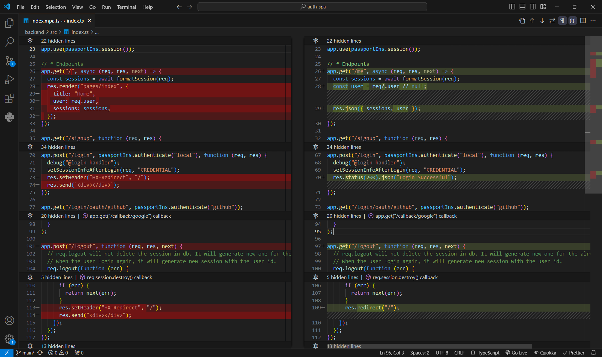
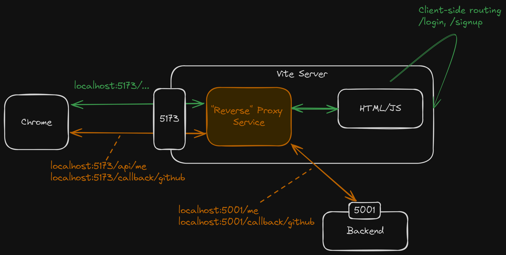
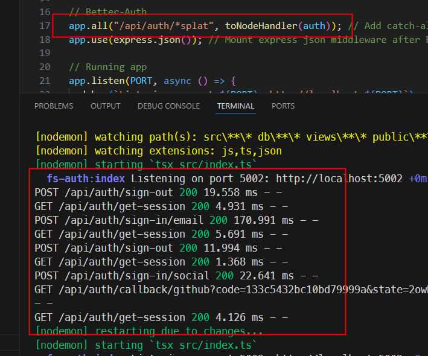

<style>
@import url('https://fonts.googleapis.com/css2?family=Prompt:ital,wght@0,100;0,300;0,400;0,700;1,100;1,300;1,400;1,700&display=swap');

    :root {
    font-family: Prompt;
    --hl-color: #D57E7E;
}
h1 {
  font-family: Prompt
}
</style>

# Fullstack Development

---

# Authentication / Authorization

---

# Part 4: SPA

---

# Setup

- `git clone https://github.com/fullstack-68/auth-spa.git`
- Backend
  - `cd backend`
  - Fill in `.env`
  - `pnpm install`
  - `pnpm run db:reset`
  - `pnpm run dev`

---

# Setup

- Frontend
  - `cd frontend`
  - `pnpm install`
  - `pnpm run dev`

---

# Backend

- Routes now return json / redirect header instead of html.
- Created `GET /me` route for clients to check their `auth`' states.
- Apart from that, there is very mininal change, surprisingly.

---



---

# Frontend

- Created (client-side) routing.
- Created logic to query/update `auth`'s state.
- Modified proxy server to take care of `Callback URL` (bypass client-routing).
- Created signup form/login and other UI.

---

# Highlighted packages

```json
{
  "@tanstack/react-query": "^5.85.5",
  "react-router": "^7.8.2"
}
```

---

# Client-side routing

`src/App.tsx`

```ts
import { RouterProvider } from "react-router/dom";
import { createBrowserRouter } from "react-router";
const router = createBrowserRouter([
  {
    path: "/",
    element: <Layout />,
    children: [
      {
        path: "/",
        element: <Home />,
      },
    ],
  },
]);
```

---

# Client-side routing

`src/App.tsx`

```ts
function App() {
  return (
    // ...
    <RouterProvider router={router} />
    // ...
  );
}

export default App;
```

---

# Getting auth state

`src/hooks/useAuth.ts`

```ts
import { useQuery } from "@tanstack/react-query";
// ...
function getMe() {
  return axios.get<AuthData>("/api/me");
}

function useAuth() {
  // Queries
  const { data, error, refetch } = useQuery({
    queryFn: getMe,
    // Other options
  });
  return { user: data?.user, sessions: data?.sessions, error, refetch };
}
```

---

# Getting auth state

`src/components/Nav.tsx`

```ts
const Nav: FC = () => {
  const { user } = useAuth(); 👈👈👈
  // ...
  return (
    <nav>
      // ...
    </nav>
  );
};

export default Nav;
```

---

# Handle `Callback URL`

`vite.config.ts`

```ts
export default defineConfig({
  plugins: [react()],
  server: {
    proxy: {
      "/api": {
        // ...
      },
      "/callback": { 👈👈👈
        target: "http://localhost:5002",
      },
    },
  },
});
```

---



---

# With proxy server

- The cookie will automatically sent to backend for all requests because it is the "same site".

---

# If you don't have proxy server.

- Cookies are still automatically sent given the same host but different port.
- Need to set `withCredentials` to `true` on any AJAX request (via `fetch` or `axios` APIs)
  - Note that `httpOnly` cookie are sent by this technique.
- Need to allow CORS in the backend.

---

# But we still need more

- More OAuth providers
- Forget password feature
- Email confirmation
- OTP link
- Two factor authentication
- Passkey
- ...

---

> When can I start building my stuff?

---

# Third-party solution

- _On cloud_
  - [Clerk](https://clerk.com/)
- _On premise_
  - [AuthJS](https://authjs.dev/)
    - I used this [last year](https://youtu.be/INIz-AZ9bR8?si=DzEbiAou2oq4_hy2&t=1842)
  - [Better-Auth](https://www.better-auth.com/)

---

# `Better-Auth`

---

# Design

- `Better-Auth` (and `AuthJS`) **is not a middleware**.
  - Unlike `passport`
- It provides ready-made API endpoints.
- This architecture is more suitable for SPAs and fullstack frameworks (`NextJS`).
  - _Using it with MPA is quite unintuitive._

---

# Setup

- `git clone https://github.com/fullstack-68/auth-spa-better-auth.git`
- Backend
  - `cd backend`
  - Fill in `.env`
  - `pnpm install`
  - `pnpm run db:reset`
  - `pnpm run dev`

---

# Setup

- Frontend

  - `cd frontend`
  - `pnpm install`
  - `pnpm run dev`

---

# Note

- [DB schema](https://www.better-auth.com/docs/adapters/drizzle#schema-generation--migration)
- `npx @better-auth/cli@latest generate`

---

# New routes (backend)



---

# Frontend client

`useAuth.ts`

```ts
import { useQuery } from "@tanstack/react-query";
import { authClient } from "../lib/auth-client";
function getMe() {
  return authClient.getSession();
}
```

---

# Sign up

`Signup.tsx`

```ts
const res = await authClient.signUp.email({
  email,
  password,
  name,
  image: "logos/robot.png",
});
```

---

# Login (email)

```ts
const res = await authClient.signIn.email({
  email,
  password,
  rememberMe: true,
});
```

---

# Login (Social)

```ts
const signInGitHub = async () => {
  const data = await authClient.signIn.social({
    provider: "github",
  });
  console.log({ data });
};
```

---

# More features

- Forget password
- Email confirmation
- OTP link
- Two factor
