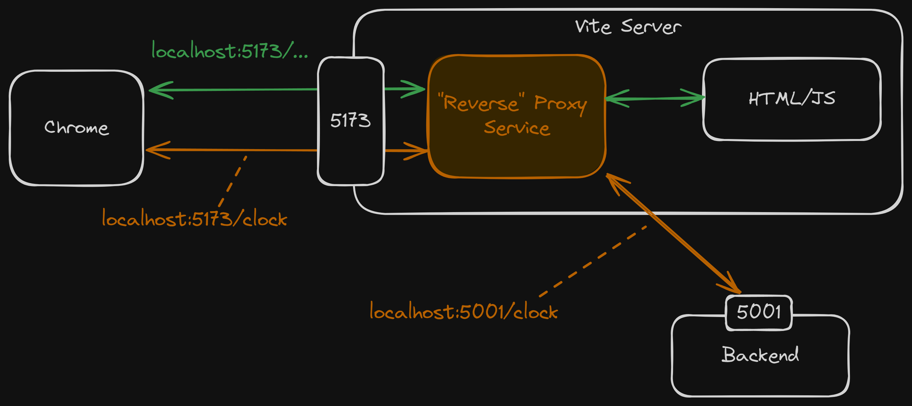
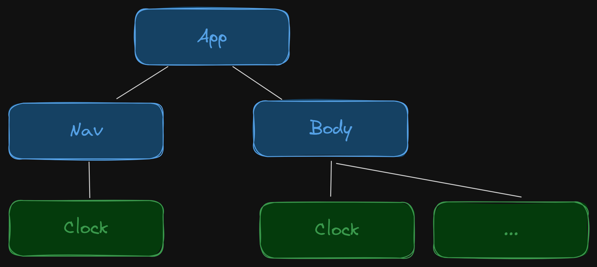
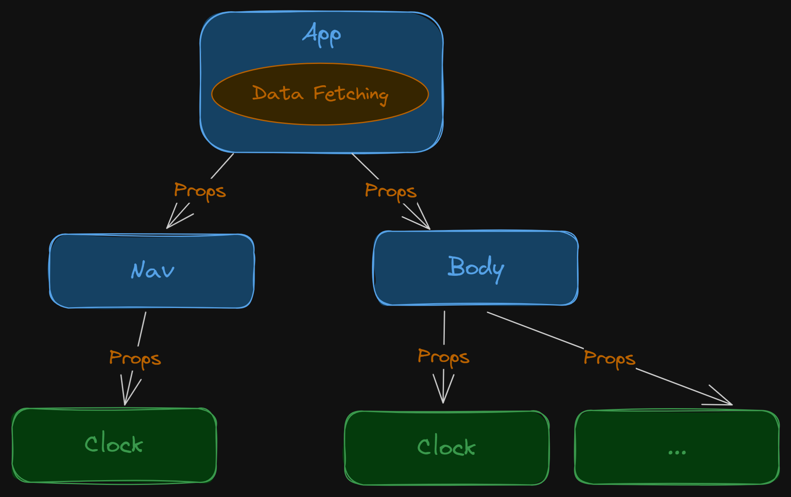
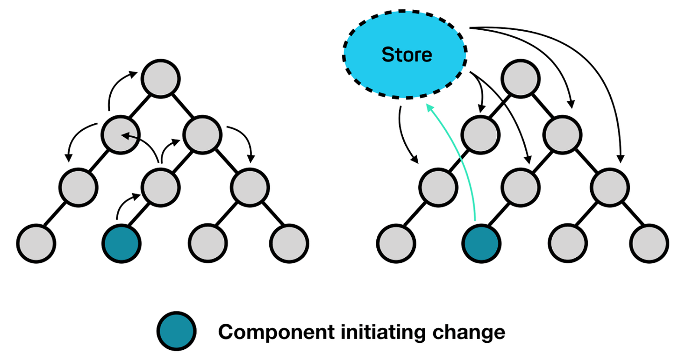
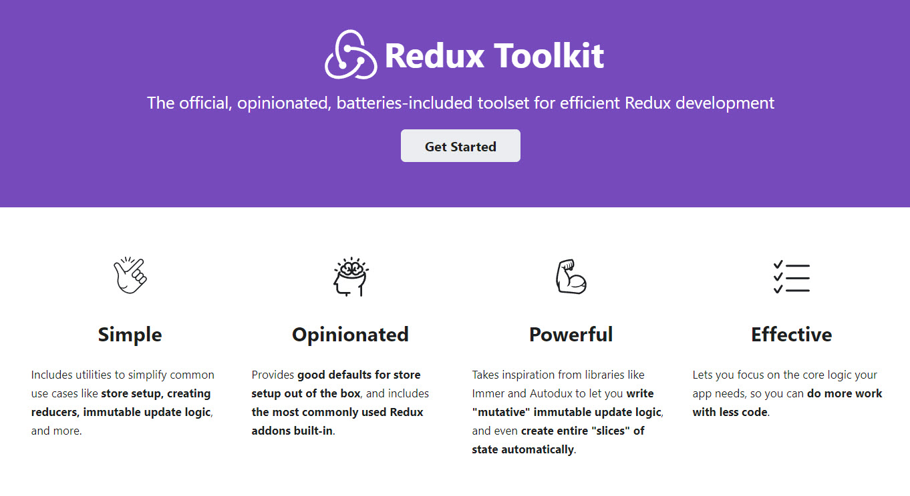
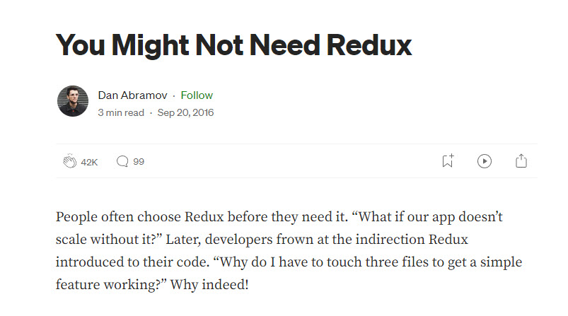

<style>
@import url('https://fonts.googleapis.com/css2?family=Prompt:ital,wght@0,100;0,300;0,400;0,700;1,100;1,300;1,400;1,700&display=swap');

    :root {
    font-family: Prompt;
    --hl-color: #D57E7E;
}
h1 {
  font-family: Prompt
}
</style>

# Fullstack Development

---

# Data Fetching and State Management

---

# Case Study

> Fetching Clock from External Service

---

# External Service

- `git clone https://github.com/fullstack-68/df-backend.git`
- `pnpm i`
- `pnpm run dev`

http://localhost:3001/clock

---

# Part 1: Single Page Application (SPA)

---

# Part 1.1: `useEffect`

- `git clone https://github.com/fullstack-68/df-spa.git`
- `cd df-spa`
- `git checkout -t origin/useeffect`

---

# Application architecture



---

# Frontend component tree



---

`./src/components/Clock.tsx`

```ts
const Clock: FC<Props> = () => {
  const [clock, setClock] = useState("");
  const refetch = () => {
    // Fetching logic
  };
  useEffect(() => {
    refetch();
  }, []);
  // return JSX
};
```

---

# `useEffect`

- `Good`
  - No external library required
- `Bad`
  - Confusing to write
- `Comment`
  - States are all local.
  - Notice data fetching from each component instance (many times).

---

# Part 1.2: `useEffect` + Custom hook

---

# Setup

- `git checkout -t origin/custom-hook`

---

`./src/hooks/useClock.ts`

```ts
function useClock() {
  const [clock, setClock] = useState("");
  const refetch = () => {
    // Fetching logic
  };
  useEffect(() => {
    refetch();
  }, []);

  return { clock, refetch };
}
```

---

# `useEffect` + Custom hook

- `Good`

  - Logic encapsulation
  - Cleaner components

- `Comment`
  - States are still all local.

---

# Part 1.3: `useEffect` + Prop drilling

---

# Prop drilling

- `git checkout -t origin/prop-drilling`

---

# Prop drilling



---

# `useEffect` + Prop drilling

- `Good`
  - No external library required
  - Pure components
- `Bad`
  - Impractical for deep-nested components.
  - Fetching logic is too "far" from the view (JSX).
- `Comment`
  - Notice that we don't have to separately fetch data foreach component anymore (good).

---

# Part 1.4: `useEffect` + Global store

---

# Global store pattern

What does using a global store solve?

- Multiple copies of states
- Prop drilling
- Unncessary re-render

---



---

# Global store libraries / API

- `React Context`
- `Redux`
- `Zustand`
- `Jotai`

---

# React Context

- Native API
- Fine, but...

---

```ts
const App = () => {
  // ... some code
  return (
    <>
      <ReduxProvider value={store}>
        <ThemeProvider value={theme}>
          <OtherProvider value={otherValue}>
            <OtherOtherProvider value={otherOtherValue}>
              {/** ... other providers*/}
              <HellProvider value={hell}>
                <HelloWorld />
              </HellProvider>
              {/** ... other providers*/}
            </OtherOtherProvider>
          </OtherProvider>
        </ThemeProvider>
      </ReduxProvider>
    </>
  );
};
```

---

# Redux

- Powerful
- Has Redux Dev Tool
- Can be used standalone
- Too much boiler plate for small projects

---



---

## 

---

# Zustand

- Minimalist
- Use Redux-style (flux principle)
- No provider

---

# Setup

- `git checkout -t origin/zustand`

---

# Store

`./src/stores/useGlobalStore.ts`

```ts
import { create } from "zustand";

interface Store {
  clock: string;
  setClock: (c: string) => void;
}

const useGlobalStore = create<Store>((set) => ({
  clock: "",
  setClock: (c) => set(() => ({ clock: c })),
}));
```

---

`./src/components/Clock.tsx`

```ts
import useGlobalStore from "../stores/useGlobalStore";
import { useShallow } from "zustand/react/shallow";

const Clock: FC<Props> = () => {
  // No useState now
  const [clock, setClock] = useGlobalStore(
    useShallow((state) => [state.clock, state.setClock])
  );

  const refetch = () => {
    // Fetching logic
  };
  useEffect(() => {
    if (initialFetch) refetch();
  }, []);

  // return JSX
};
```

---

# `useEffect` + Global store

- `Good`
  - Shared state.
  - Less network requests
- `Bad`
  - Not pure components

---

# Jotai

- `git checkout -t origin/jotai`

---

# Atom

```ts
import { useAtom, atom } from "jotai";

const clockAtom = atom("");

const Clock: FC<Props> = () => {
  const [clock, setClock] = useAtom(clockAtom);

  //...
};
```

---

# Jotai vs Zustand

> Bottom Up vs Top Down
> https://github.com/pmndrs/jotai/issues/13

---

# Part 1.5: Tanstack Query + Custom hook

---

# Tanstack Query

- Data-fetching + state management library
- Highly recommended!

---

# Setup

- `git checkout -t origin/tanstack-query`

---

# Provider

`./src/main.tsx`

```ts
import { QueryClient, QueryClientProvider } from "@tanstack/react-query";
import { ReactQueryDevtools } from "@tanstack/react-query-devtools";

// Create a client
const queryClient = new QueryClient();

createRoot(document.getElementById("root")!).render(
  <StrictMode>
    <QueryClientProvider client={queryClient}>
      <App />
      <ReactQueryDevtools initialIsOpen={false} />
  </StrictMode>
);
```

---

`./src/hooks/useClock.ts`

```ts
import { useQuery } from "@tanstack/react-query";

function getClock() {
  // Return promise
}

function useClock() {
  const query = useQuery({
    // Options
  });

  return { clock: query.data ?? "", refetch: query.refetch };
}

export default useClock;
```

---

# Note

- Try inspect `query` object.
- Try navigate away and refocus the tab.
- Try option `refetchInterval`
- Try using the dev tool.

---

# React Query + Custom hook

- `Good`
  - Do I have to repeat myself?
- `Bad`
  - A little bit of setup / learning curve
- `Note`
  - Use it please.

---

# Part 2: Next.js

---

# Setup

- `git clone https://github.com/fullstack-68/df-nextjs.git`

---

# Strategy

- Use `server component` to fetch data.
  - [`fetch` API](https://nextjs.org/docs/app/api-reference/functions/fetch)
- Even though `fetch` is used in multiple instances (`clock`), Next.js automatically caches data so only one API called will be sent.
- We can use `server action` to refetch data.

---

```ts
import { revalidatePath } from "next/cache";

const Clock: FC<Props> = async () => {
  const res = await fetch("http://localhost:3001/clock"); // This is cached.
  const json = await res.json();
  const clock = json.data;

  // Server action for refetching
  async function refetch() {
    "use server";
    revalidatePath("/");
  }
  return <form action={refetch}>...</form>;
};
```

---

# Server Components

- `Good`
  - Fetching server-side is better. Less problem.
- `Bad`
  - Not interactive? (I am sure there is a solution for this.)

---

# Part 3: Real-Time

---

# Options

- Websocket
- Server-Sent events

---

# Websocket

- Protocol that establishes a full-duplex communication channel over a single TCP connection
  - Send data to the browser + receive data from the browser (`bi-directional`)
- Can transmit both binary data and UTF-8.
- Usage
  - Chat application

---

# Server-Send events

- SSE establishes a long-open HTTP channel from server to client.
  - Data only flows from a server to clients (`uni-directional`)
- Usage
  - Online stock quotes
  - Timeline or feed view

---

# Advantages of SSE over Websockets:

- Transported over simple HTTP instead of a custom protocol.

- Existing authentication and authorization (such as cookies, headers, session tokens, or middleware) will automatically apply to the SSE endpoint.

- No trouble with corporate firewalls doing packet inspection

---

# Advantages of Websockets over SSE:

- Real time, two directional communication.
- Native support in more browsers
- Only WS can transmit both binary data and UTF-8
  - SSE is limited to UTF-8.

---

# SSE Gotchas

- Limited number of open connections
  - Maximum of 6 tabs per browser + domain
  - Browser restriction, not server

---

# Part 3.1: Server-Sent Event

(Back to `df-spa` folder)

- `git checkout -t origin/sse`

---

# Backend

```js
// Server-Send Event Endpoint
app.get("/sse/clock", async (req, res, next) => {
  const headers = {
    "Content-Type": "text/event-stream",
    Connection: "keep-alive",
    "Cache-Control": "no-cache",
  };
  res.writeHead(200, headers);

  // ...
});
```

---

# Test SSE on Console

```js
es = new EventSource("/sse/clock");
es.onmessage = (e) => console.log(e);
es.close();
```

---

# Frontend

```js
useEffect(() => {
  function initSSE() {
    const events = new EventSource("/api/sse/clock");
    events.onmessage = (e: any) => {
      setClock(e?.data ?? "");
    };
  }
  initialFetch && initSSE();
}, []);
```

---

# Side Note: Todo apps (SSE)

- `git clone https://github.com/fullstack-68/df-sse-todo.git`

---

# Part 3.2: Websocket

(Back to `df-spa` folder)

- `git checkout -t origin/websocket`

---

# Backend

```js
// SocketIO Integration
const server = http.createServer(app);
const io = new SocketIOServer(server);

io.on("connection", (socket) => {
  console.log("a user connected");
  setInterval(function () {
    // const dtStr = dayjs().format("DD/MM/YYYY HH:mm:ss");
    const dtStr = dayjs().format("HH:mm:ss");
    io.sockets.emit("clock", { clock: dtStr });
  }, 1000);
});
```

---

# Frontend

- Add new proxy endpoint in `vite.config.ts`
- Create socket client in `./src/socket.ts`

---

# Frontend

`./src/App.tsx`

```js
useEffect(() => {
  // ...
  function onClockEvent(value: { clock: string }) {
    setClock(value.clock);
  }
  socket.on("clock", onClockEvent);
  // ...
}, []);
```
