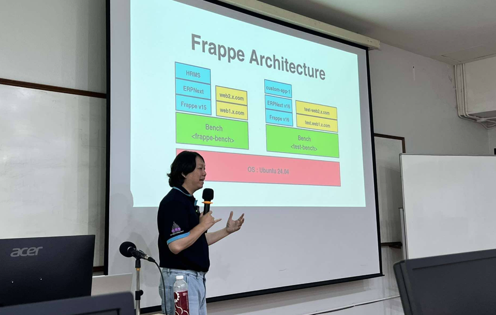
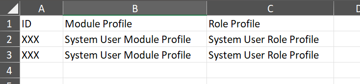
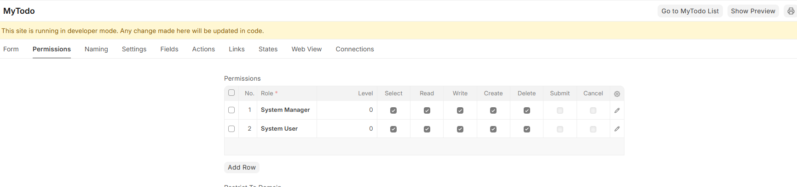
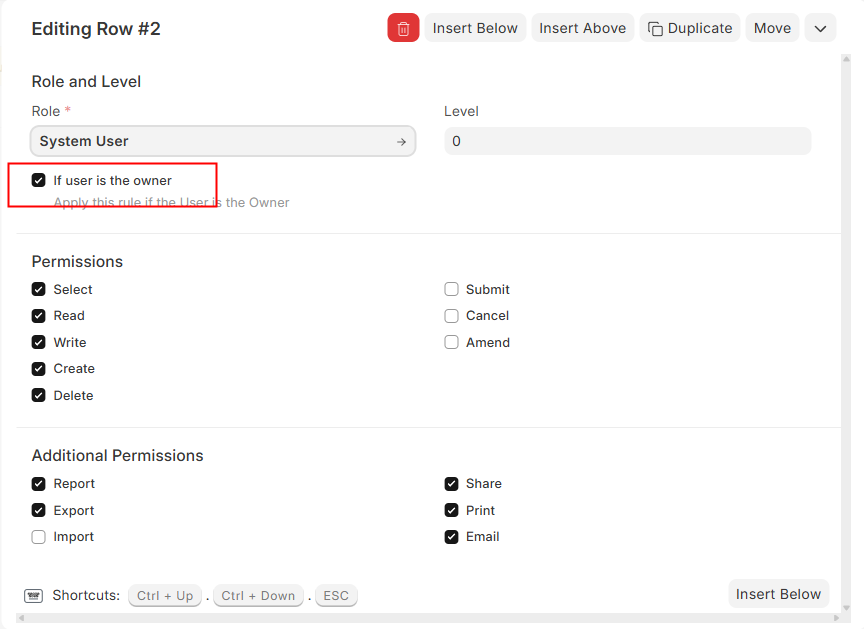
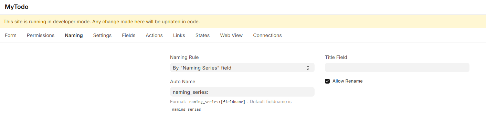
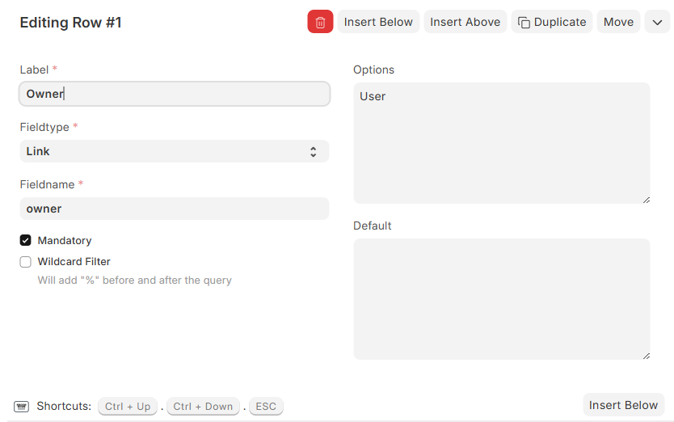
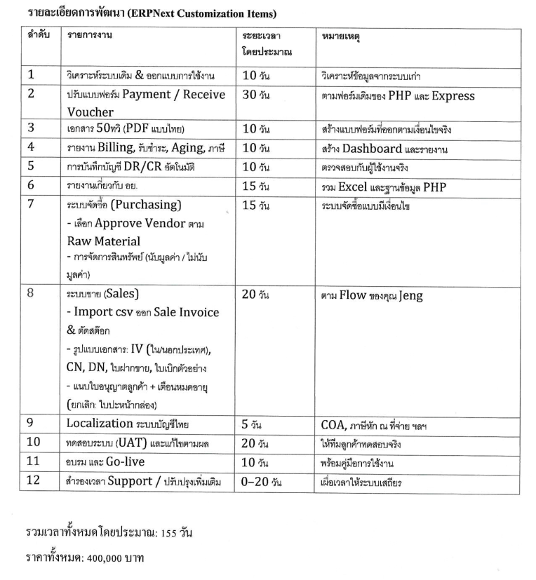

<style>
@import url('https://fonts.googleapis.com/css2?family=Prompt:ital,wght@0,100;0,300;0,400;0,700;1,100;1,300;1,400;1,700&display=swap');

    :root {
    font-family: Prompt;
    --hl-color: #D57E7E;
}
h1 {
  font-family: Prompt
}
</style>

# Fullstack Development

---

# Frappe Framework

> Fuller-stack

---

# What is it?

- An open-source, full-stack web framework written in Python and JavaScript.
- Designed for rapid development of database-heavy business applications.
  - DocType system for defining data model-view-controller.
  - ORM for simplifying database operations,
  - Automatic generation of REST APIs.

---

# What is it?

- The foundation for [ERPNext](https://frappe.io/erpnext),
  - Enterprise Resource Planning (ERP) system,
- Also used to build various web applications such as CRMs, inventory systems, and custom portals.

- Taught at วิศวกรรมซอฟต์แวร์ มหาวิทยาลัยพะเยา

---



---

# Let's build a Todo App

- User registration
- User role / permission
- User can only see own todo.
- Admin can see all todo.
- Report summary

---

# Time Limit

> 30 minutes

---

https://fs-frappe.iecmu.com

---

# Set User (Import Tool)

- Module Profile : `System User Module Profile`
- Role Profile : `System User Role Profile`



(Admin) `bench --site local destroy-all-sessions`

---

# DocType (1)

- Name: `MyTodo`
- Fields
  - `naming_series` (Data / Hidden)
    - Default `MYTODO-.####.`
  - `title` (Data / List View)
  - `due_date` (Date / List View)
  - `is_done` (Data / List View/ List Filter)
  - `done_date` (Date / List View)

---

# DocType (2)

- Permission
  

---

# DocType (2)

- Permission
  

---

# DocType (3)

- Naming
  

---

# DocType (4)

(Admin)

- `bench restart`
- `bench --site local destroy-all-sessions`

---

# Controller

`mytodo.py`

```python
import frappe
from frappe.model.document import Document

class MyTodo(Document):
    def before_insert(self):
        # Current user
        user = frappe.session.user
        # Find all todos for the current user that is not done
        items = frappe.get_all("MyTodo", filters={"owner": user, "is_done": 0}, fields=["name"])
        # Prevent submission
        if len(items) >= 3:
            frappe.throw("Cannot submit because more than 3 items are not done.")
```

- `bench restart`

---

# View

```js
frappe.ui.form.on("MyTodo", {
  is_done: function (frm) {
    if (frm.doc.is_done) {
      // Set 'done_date' to the current datetime
      frm.set_value("done_date", frappe.datetime.now_datetime());
    } else {
      // Clear the done_date if unchecked
      frm.set_value("done_date", null);
    }
  },
});
```

- Set `done_date` to `read only` in DocType.

---

# Query Report (R1)

```sql
SELECT t.owner  AS "Owner:Link/User:200",
       Count(*) AS "Total Todos:Data:200"
FROM   tabMyTodo AS t
GROUP  BY t.owner
ORDER  BY Count(*) DESC;
```

- Check permission

---

# Query Report (R2)

```sql
SELECT t.name AS "name:Data:200",
       t.owner AS "Owner:Link/User:200",
       t.title AS "Title:Data:200",
       t.due_date AS "Due Date:Date:200",
       t.is_done AS "Done:Check:200",
       t.done_date AS "Done Date:Date:200"
FROM   tabMyTodo AS t
WHERE  t.owner = %(owner)s;
```

- Check permission

---

# Filters Option



---


